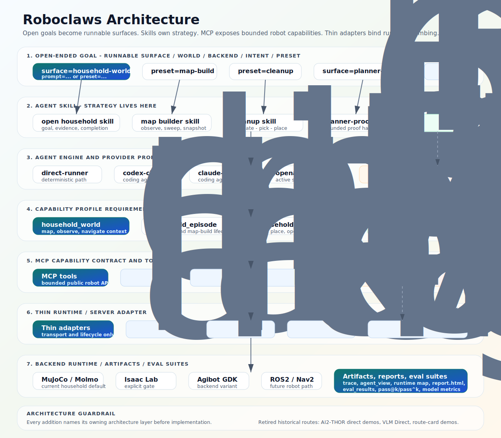

# Architecture

Roboclaws is a thin robotics demo repo. Its architecture goal is not to hide
robot work behind one opaque tool; it is to make every run reviewable through
public task inputs, MCP tool traces, maps, reports, and private-evaluation
boundaries.

For commands, start with [`README.md`](README.md). For the task/skill/profile
model, read
[`docs/human/mcp-skills-and-semantic-profiles.md`](docs/human/mcp-skills-and-semantic-profiles.md).



## Core Model

The current human-facing layers are:

```text
Open-ended goal
  -> Runnable Task
  -> Agent Skill
  -> Capability Profile requirements
  -> MCP Capability Tools
  -> Backend Variant
  -> Artifacts and reports
```

- **Runnable Tasks** are public run surfaces such as `ai2thor-nav`,
  `semantic-map-build`, and `household-cleanup`. They own command names,
  parameters, report shape, and acceptance gates.
- **Agent Skills** own strategy: prompts, scripts, examples, recovery loops,
  and trace-preserving routines such as `navigate -> pick -> place`.
- **Capability Profiles** define reusable capability environments. Skills
  require profiles; profiles should not be copied into task-specific supersets.
- **MCP Tools** are the stable public robot interface: observe, navigate, map,
  pick, place, done, and related bounded capabilities.
- **Backend Variants** implement the same public shape in mock, simulator, API,
  or physical-robot environments.

The real-robot rule is: physical runs should reuse the same task, skill,
profile, and MCP tool layers. They differ by backend variant, provenance, safety
gates, operator map context, and blocked-capability status.

## Major Stacks

Roboclaws currently has two embodied-demo stacks.

### AI2-THOR Navigation

This stack proves multi-agent navigation and coding-agent MCP control over
AI2-THOR scenes.

Key pieces:

- `roboclaws/core/engine.py` owns the `MultiAgentEngine` wrapper around
  AI2-THOR.
- `roboclaws/core/vlm.py` and `roboclaws/core/providers/` own provider routing.
- `roboclaws/mcp/server.py` exposes the AI2-THOR navigation MCP surface.
- `examples/games/` and `examples/mcp/` contain runnable entrypoints.

The canonical navigation tools are `observe`, `observe_archived`, `move`, and
`done`. Simulator helpers such as `scene_objects` and `goto` are privileged
opt-ins for demos; they are not real-robot capability claims.

### Household World And Cleanup

This stack proves household world understanding, semantic cleanup, runtime maps,
and future physical robot parity.

Key pieces:

- `roboclaws/household/realworld_contract.py` owns the public/private
  household contract.
- `roboclaws/household/semantic_cleanup_loop.py` owns the direct semantic
  cleanup flow.
- `roboclaws/maps/` owns reusable navigation map artifacts and projections.
- `roboclaws/household/realworld_mcp_server.py` exposes the cleanup MCP
  surface for coding agents and OpenClaw-style clients.
- `roboclaws/household/report.py` renders the shared report.
- `roboclaws/household/camera_control.py` owns the external render-camera
  request schema used by MuJoCo/Isaac scene probes.
- `roboclaws/household/agibot_sdk_runner.py` and
  `vendors/agibot_sdk/tools/run_agibot_cleanup_backend.py` keep the Agibot SDK
  boundary behind a subprocess runner.

The clean-slate direction is:

- `semantic-map-build` is a Runnable Task for producing Runtime Metric Map
  snapshots.
- `household-cleanup` is a Runnable Task for cleanup runs.
- The canonical map flow is minimal-first: start from occupancy/free-space
  navigation context, run `semantic-map-build`, then feed the resulting
  `runtime_metric_map.json` to cleanup with `runtime_map_prior=...` when a
  prior sweep is useful.
- `household_world_v1` is the reusable world-understanding capability profile.
- Manipulation capability should be composed as a separate requirement when a
  skill needs `pick`, `place`, `open_receptacle`, or `close_receptacle`.

## Public Command Surface

The public command grammar is intentionally small:

```bash
just task::run <task> <driver> [report|profile] [key=value ...]
```

Examples:

```bash
just task::run ai2thor-nav codex visual
just task::run semantic-map-build direct world-labels seed=7
just task::run household-cleanup direct world-labels seed=7
```

For household tasks, the third positional token is a cleanup input/evidence
lane. `world-labels` means the agent receives structured object handles and
labels; it does not select online/offline map behavior. The default map
projection is `map_mode=minimal`, which exposes occupancy geometry, generated
exploration candidates, and runtime semantic anchors instead of authored room
or fixture labels. Use `runtime_map_prior=...` to consume a prebuilt runtime map
snapshot. `map_mode=rich` remains only as an explicit legacy/debug shortcut for
tests that need pre-authored public fixture semantics.

The clean-slate household naming is the public surface: `semantic-map-build`
produces Runtime Metric Map snapshots, and `household-cleanup` consumes
household-world evidence for cleanup. Older Molmo-specific task/profile names
are legacy compatibility details, not the canonical task layer.

## Capability Profiles

`roboclaws/mcp/profiles.py` defines current MCP capability metadata. The
household head is `household_world_v1`, composed with
`household_manipulation_v1` and `household_episode_v1` for cleanup skills.
Older backend/domain ids such as `molmospaces_cleanup_v1` and
`real_robot_cleanup_v1` remain legacy compatibility details.

Going forward:

- Profiles describe reusable capability environments, not whole tasks.
- Skills compose profiles by requirement; profiles should not copy other
  profiles' tool lists.
- Backend variants belong in metadata/config, not in public task names.
- Private generated mess sets, acceptable destinations, hidden target lists,
  private manifests, and private scorer truth must not appear in public profile
  metadata or agent-facing inputs.

## Runtime Artifacts

Every serious run should produce reviewable evidence:

- `trace.jsonl` for tool calls and state transitions.
- `agent_view.json` / `run_result.json` for public agent-facing state.
- `runtime_metric_map.json` when a run builds or updates household world
  evidence.
- `report.html` for human review.
- Optional planner-proof bundles when cleanup substeps are checked against
  local RBY1M/CuRobo proof.

The artifact boundary matters: public agent evidence and private scoring truth
must remain separate. Reports may display both, but agent inputs and MCP
profiles must not leak private evaluator data.

## Real-Robot Boundary

Real-robot work is incremental:

1. Prove public map context and observation.
2. Prove bounded navigation to operator-approved waypoints or backend-verified
   goals.
3. Keep manipulation as `blocked_capability` until physical proof exists.
4. Promote physical manipulation only when reports can show provenance, safety
   gates, and failure modes.

Agibot G2 and ROS2/Nav2 should be backend variants under the same public
task/profile shape, not separate robot-only task taxonomies.

## Where To Look

| Need | Start here |
| --- | --- |
| What to run | [`README.md`](README.md), [`just/README.md`](just/README.md) |
| Task/skill/profile design | [`docs/human/mcp-skills-and-semantic-profiles.md`](docs/human/mcp-skills-and-semantic-profiles.md) |
| MolmoSpaces settings | [`docs/human/molmospaces-settings.md`](docs/human/molmospaces-settings.md) |
| Local runtime and keys | [`docs/human/local-runtime.md`](docs/human/local-runtime.md) |
| Current project focus | [`STATUS.md`](STATUS.md) |
| Detailed plans and evidence | `docs/plans/`, `docs/status/active/`, `docs/retrospectives/` |
