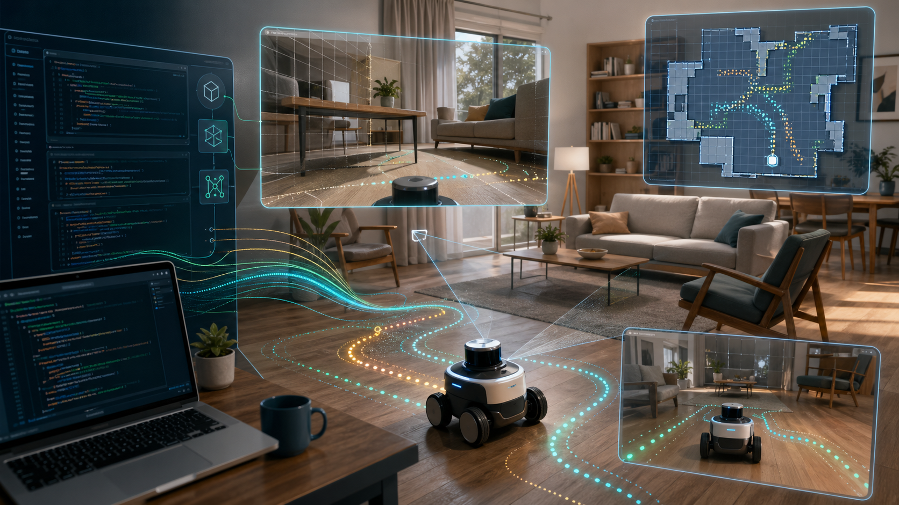
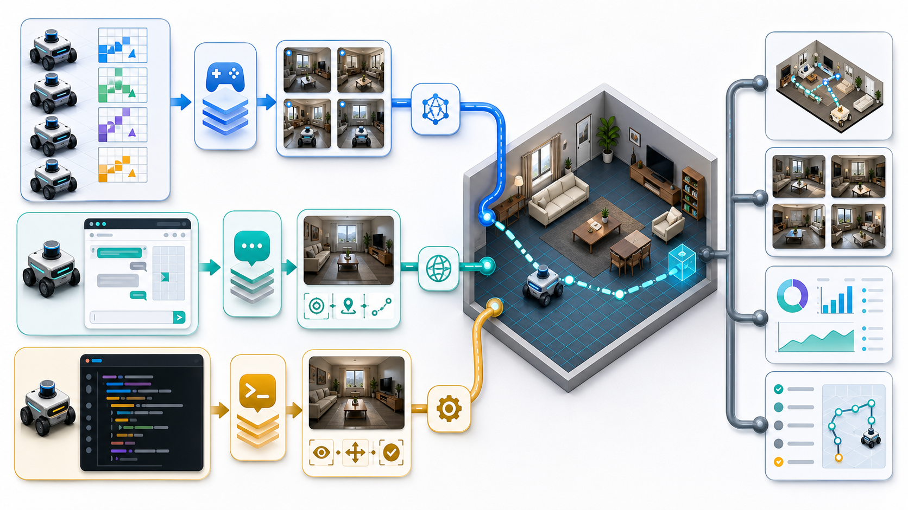
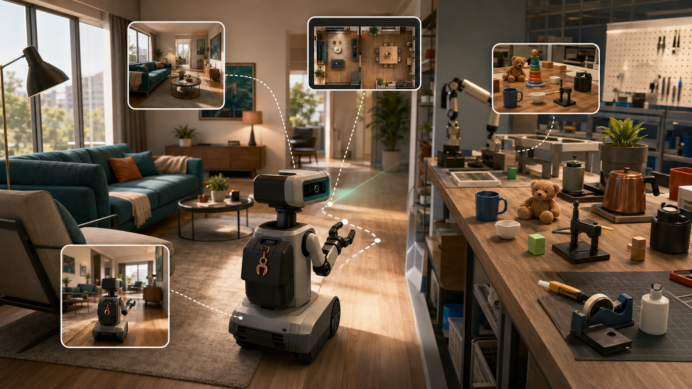

# Roboclaws

[](https://github.com/MiaoDX/roboclaws/actions/workflows/ci.yml)
[](https://miaodx.com/roboclaws/)
[](./pyproject.toml)
[](https://docs.astral.sh/uv/)
[](./LICENSE)

**AI coding agents and VLM/OpenClaw agents driving simulated robots in AI2-THOR.**



Roboclaws is a robotics demo repo with one practical goal: make agent behavior
visible. It can run multi-agent territory and coverage games, OpenClaw Gateway
chat demos, a hosted Railway appliance, and a direct Codex/Claude Code MCP path
where the coding agent itself drives the robot with `observe`, `move`, and
`done`.

> Operational hint: if the live smoke reports look stale, check the
> `CI (main)` badge first. GitHub Pages republishes only after CI succeeds on
> `main`.

## What You Can Run

| Mode | Use it for | Entry point |
|------|------------|-------------|
| Direct VLM games | Fast local experiments without OpenClaw | `just task::run territory vlm`, `just task::run coverage vlm` |
| OpenClaw Gateway demos | Persistent agents, SOULs, browser Control UI | `just task::run ai2thor-nav openclaw` |
| Direct Codex / Claude driver | Let a normal coding agent drive AI2-THOR over MCP | `just task::run ai2thor-nav codex`, `just task::run ai2thor-nav claude` |
| Photo-task smoke | "Walk the room and photograph each chair/sofa" validation | `just task::run photo-chairs openclaw` |
| Railway appliance | Hosted single-container demo with UI, viewer, Gateway, AI2-THOR | `DEMO_PASSWORD=demo just appliance::run local` |
| MolmoSpaces cleanup | Household cleanup reports with Agent View, Private Evaluation, RBY1M views, and checker gates | `just task::run molmo-cleanup direct`, minimal: `just task::run molmo-cleanup mcp-smoke minimal` |
| MolmoSpaces planner proof | Generate or execute bound RBY1M/CuRobo proof requests from cleanup artifacts | `just task::run molmo-planner-proof direct`, local: `just task::run molmo-planner-proof direct mode=execute-rerun` |
| Mock reports | CI-safe visualization/report regression coverage | `python scripts/reports/generate_demo_report.py --output-dir output/demo` |
| Self-improvement harness | Score the navigator skill on a curated task, append metrics to a logbook | `just agent::harness run <task>` (see [`harness/README.md`](harness/README.md)) |



## Architecture


See [`ARCHITECTURE.md`](ARCHITECTURE.md) for the code map, the AI2-THOR
operating modes, the MolmoSpaces cleanup/proof flow, and the shared MCP
contracts.

## Quick Start

```bash
uv sync --extra dev --extra openclaw
```

For real VLM/OpenClaw runs, load one provider key:

```bash
export KIMI_API_KEY=...       # Kimi / Moonshot
export MIMO_TP_KEY=...        # MiMo, used by the interactive chat defaults
export NV_API_KEY=...         # NVIDIA NIM
export ANTHROPIC_API_KEY=...  # Claude direct VLM path
export OPENAI_API_KEY=...     # OpenAI direct VLM path
```

### Run a Game

```bash
python examples/games/territory_game.py --agents 3 --scene FloorPlan201
python examples/games/coverage_game.py --agents 3 --scene FloorPlan201
```

### Run OpenClaw

```bash
just task::run ai2thor-nav openclaw
```
`just task::run ai2thor-nav openclaw` is the normal navigation entrypoint.
Useful companion terminals for the lower-level browser-control workflow:

```bash
just chat::tail
just chat::view
```

> Recipes are run via [`just`](https://just.systems/) — see
> [`docs/human/contributing.md`](docs/human/contributing.md) for the one-line install +
> tab-completion setup. `just --list` shows the small public facade; the
> full task grammar is in [`just/README.md`](just/README.md).

### Let Codex or Claude Drive the Robot

Preferred one-command workflows:

```bash
just task::run ai2thor-nav codex
just task::run ai2thor-nav claude
```

Those recipes start the MCP server, register `roboclaws`, launch the coding
agent, and clean up the server on exit.

Optional repo-local model overrides can live in `.env`:

```bash
ROBOCLAWS_CODEX_MODEL=gpt-5.2
ROBOCLAWS_CLAUDE_MODEL=sonnet
```

The launchers pass these as per-run `--model` flags. If unset, Codex and
Claude Code use their normal system-configured defaults.

Manual server flow:

```bash
python examples/mcp/coding_agent_nav_server.py --scene FloorPlan201
```

In another terminal:

```bash
codex mcp add roboclaws --url http://127.0.0.1:18788/mcp
# or
claude mcp add --transport http roboclaws http://127.0.0.1:18788/mcp
```

Then start Codex or Claude Code in this repo and ask it to read
`skills/ai2thor-navigator/SKILL.md`, call `roboclaws__observe` first, and
use labeled observes as photos.

Full guide: [docs/human/coding-agent-nav-server.md](docs/human/coding-agent-nav-server.md).

## Live Reports

Every successful push to `main` publishes interactive artifacts to GitHub
Pages. Reports include first-person frames, map/chase views, replay GIFs,
tool traces, and run metrics.

| Territory Control | Cooperative Coverage |
|-------------------|----------------------|
|  |  |
| [Mock report](https://miaodx.github.io/roboclaws/territory/report.html) | [Mock report](https://miaodx.github.io/roboclaws/coverage/report.html) |

| Stack | Territory | Coverage |
|-------|-----------|----------|
| Mock CI | [report](https://miaodx.github.io/roboclaws/territory/report.html) | [report](https://miaodx.github.io/roboclaws/coverage/report.html) |
| Kimi + real AI2-THOR | [report](https://miaodx.github.io/roboclaws/smoke/territory/report.html) | [report](https://miaodx.github.io/roboclaws/smoke/coverage/report.html) |
| OpenClaw + Kimi | [territory](https://miaodx.github.io/roboclaws/openclaw/territory/report.html) | [coverage](https://miaodx.github.io/roboclaws/openclaw/coverage/report.html) |

OpenClaw navigation report:
[openclaw/demo/report.html](https://miaodx.github.io/roboclaws/openclaw/demo/report.html)

A side-by-side report comparison view is also available:
[report_compare.html](https://miaodx.github.io/roboclaws/report_compare.html).

## Core Demos

### Territory Control

Two or three robots compete over a discrete grid in an iTHOR living room.
Each cell belongs to the first robot that reaches it. The interesting behavior
is strategic: rapid expansion, blocking, and route recovery when an agent gets
stuck.

### Cooperative Coverage

Robots work together to see as much of the room as possible. The report shows
coverage progress, work balance, and whether agents divide the room in useful
ways.

### Navigation and Photo Tasks

The single-agent navigation loop is the smallest surface for debugging model
behavior. The photo-task smoke builds on it: the agent must move around
FloorPlan201, call `observe(label="...")` for chairs/sofas, then finish with
`done`.



```bash
just task::run photo-chairs openclaw
python scripts/openclaw/check_photo_task.py --run-dir output/openclaw-photo-task/<timestamp>
```

## Documentation Map

Human reviewers only need this small surface:

- [README](README.md) — project orientation and runnable entrypoints
- [Architecture](ARCHITECTURE.md) — code map, operating modes, and contracts
- [Current status](STATUS.md) — focus, next action, blocker, and source links
- [Human docs](docs/human/README.md) — domain vocabulary, setup, runbooks, and design context

Other docs folders are AI-agent workspace, generated planning detail, evidence,
or history. They are still checkable by agents, but they are not the normal
human review surface.

## Related Projects

- [Roboharness](https://github.com/MiaoDX/roboharness) — visual testing harness for AI coding agents in robot simulation
- [Robowbc](https://github.com/MiaoDX/robowbc) — whole-body-control experiments
- [OpenClaw](https://github.com/openclaw/openclaw) — open-source personal AI assistant
- [ROSClaw](https://github.com/PlaiPin/rosclaw) — OpenClaw to ROS 2 bridge
- [AI2-THOR](https://github.com/allenai/ai2thor) — interactive 3D indoor simulation

## License

MIT
