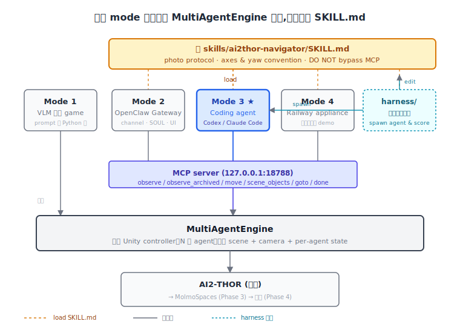
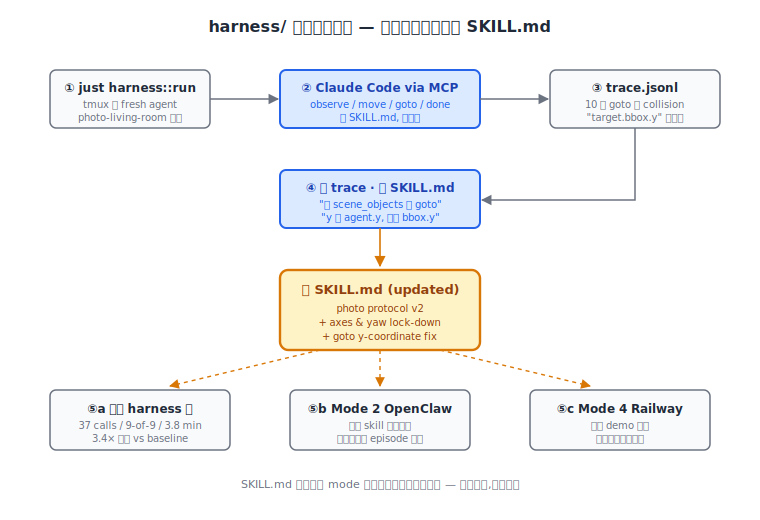
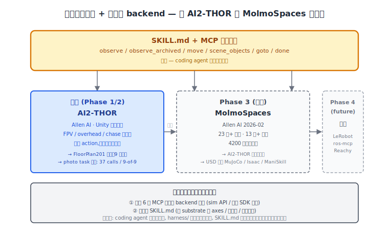

# roboclaws:给机器人以大脑——从 VLM 直驱到一份会自己更新的 SKILL.md

> 发布:2026 年 5 月
> 项目:[github.com/MiaoDX/roboclaws](https://github.com/MiaoDX/roboclaws)

---

## 楔子

有一个我自己跑了很多次的小测试。打开 AI2-THOR 仿真器,把客厅 FloorPlan201 调出来,然后给 Claude Code 发一段中文消息——

> 麻烦给这个屋子里面的每个沙发以及椅子拍个照片,走到他们的正前方拍,确保视野中只有一把沙发或者椅子,所有都拍完后,统一发给我。你可能需要走遍这个屋子才能确保都拍到,注意下 grid map,最好远离障碍物,防止你自己被卡住。

3.8 分钟之后,屋子里的 9 件家具(2 把扶手椅、1 把沙发、6 把椅子)被精确地拍了 9 张照片,每张图里都只有一个目标。Claude Code 自己结束、发了一份 summary。

更让我意外的是:跑完之后,它把"先 `scene_objects` 把房间内所有目标列表拿全,再 `goto` 一个个传送过去"这条经验**自己写进了 SKILL.md**——下一次任何一个 coding agent(或者 OpenClaw 端的助手)读到这份 skill,都会先做 `scene_objects` 而不是靠 `MoveAhead` 试错。

这就是 roboclaws 现在的状态。这篇文章想讲的,是我们怎么从最早的"VLM 直接控机器人"一路走到这一步的。

<!-- IMG: docs/assets/readme-photo-task.png — 9 张 chair/sofa 缩略图阵列,需要作者从 CI artifact 拿真实输出补 -->

## 1. roboclaws 是什么

roboclaws 是一个开源的多 agent 具身 AI 研究平台。简单说,就是让多个 AI agent 实例在 AI2-THOR 仿真客厅里同时操控机器人,跑一些"领地控制"和"协同覆盖"这类需要博弈、协作、空间推理的任务。本质上不是个人助手、也不是生产服务,是一个 demo + 研究平台。

名字 roboclaws 来自 robot + claws——和 OpenClaw 同族(Claws 文化里"机器人也来一只爪")。复数,跟上海交大 + AgiBot 那个 RoboClaw(单数,不是同一个项目)区分开。

整个项目有一个共同的内核:`MultiAgentEngine`——一个 Unity controller、N 个 agent。在这个内核之上有 4 个 operating mode 并存:

- **Mode 1**:VLM 直驱 game,自写 agent loop,无 MCP、无 Gateway。
- **Mode 2**:OpenClaw Gateway 模式,长期 daemon、per-agent SOUL、浏览器 Control UI。
- **Mode 3**:Coding agent driver,Codex / Claude Code 通过 MCP 直接控制机器人。
- **Mode 4**:Railway appliance,把上面三个 mode 打包进一个 Docker 容器对外公网部署。

下面这几节,基本就是一条时间线——讲我们怎么从 Mode 1 一路走到 Mode 3、为什么 Mode 3 + `harness/` 后来变成了架构中心、再然后准备把 substrate 切到 MolmoSpaces。

<!-- IMG: docs/assets/blog-2026-05-modes.svg — 四模式架构总览图 -->



## 2. Mode 1 — VLM 直接驱动

最早期的 roboclaws 只有一个 mode:跑 `territory_game.py` 或 `coverage_game.py`,启动几个 VLM 实例,每个实例当一个 agent。

具体怎么跑——`MultiAgentEngine` 把当前游戏状态(每个 agent 的位置、朝向、可见物体、已访问的格子)渲染成图像 + 一段结构化文本,丢给 VLM,让它输出一个动作 token(`MoveAhead` / `RotateRight` / 之类)。多个 agent 可以并行,每个用不同的 model——Anthropic、OpenAI、Kimi、MiMo、NVIDIA NIM 都接了。这正是研究员需要的:跑 ablation、对比 model、调 prompt。

这条路径**最快**。没有 Gateway、没有 MCP server、没有 daemon。改一个 prompt template、加一个新 view variant、接一个新 provider,就是改 Python 代码、跑脚本、看 replay GIF。整个反馈环大概 30 秒。

但它有一个天花板:**所有"agent 怎么决策"的逻辑都在 Python 代码里,而不是在一份独立的 skill 文件里**。当我们想让 agent 学会"先 scan 再行动"这种新策略,必须改 system prompt + 重启脚本。VLM 自己不会去更新自己的 prompt,它只会按当前 prompt 跑下一步。

这个限制不是 VLM 的问题,是 mode 1 的形态决定的。我们需要一个能把"agent 行为"独立成可编辑文件、独立成可被多个客户端复用的中间层。这就是 Mode 2 入场的原因。

## 3. Mode 2 — OpenClaw Gateway

很多读者可能听过 OpenClaw——开源的个人 AI 助手框架。截至 2026 年 4 月底,OpenClaw 主仓 ~36 万 stars、7.4 万 forks,在中文社区一直很火。它的核心抽象是 SOUL(personality preset)+ Skills(可执行能力包)+ MCP(可扩展工具层)+ Control UI(浏览器对话界面)。

我们引入 OpenClaw 是因为有一个 Mode 1 解决不了的需求:研究员要"对着运行中的 episode 说话"。比如领地游戏跑到一半,研究员看到某个 agent 总是被卡在沙发后面——想直接打字告诉它"试试 RotateLeft 90° 再走",而不是停下脚本、改 prompt、重新跑。这种"daemon + 持久 SOUL + 浏览器交互"的形态,OpenClaw 现成的最合适。

接入方式很直接:把 AI2-THOR navigator 包成一个 OpenClaw skill(对应 `skills/ai2thor-navigator/SKILL.md`),通过 OpenClaw Gateway(默认 :18789)调用。Gateway 持有 session、调度 SOUL、管理 Control UI 的 MEDIA: 路径渲染。我们把 AI2-THOR 的 FPV 截图通过 MEDIA: 协议直接 inline 进 OpenClaw 的对话气泡,就有了"一边看实时画面、一边能跟 agent 对话"的研究环境。

这条路跑通之后,OpenClaw 的 SOUL 系统也带来了很多顺手的东西:per-agent 的 personality preset(`aggressive` / `cooperative` / `defensive`)、Kimi/MiMo/Anthropic/OpenAI/NVIDIA 一键换 provider、单容器部署到 Railway 公网(就是后来的 Mode 4)。我们一度觉得"OpenClaw 就是 roboclaws 的中心了"。

直到我们撞到一堵墙:**skill 本身的迭代速度跟不上**。OpenClaw 的 Gateway 模式天然适合"用户偶发请求 → 助手挑 skill 执行 → 用户看结果"——但机器人长程任务需要的是另一种循环:"agent 失败 → 自己改 skill → 自己重跑"。每次改一行 SKILL.md,得在 OpenClaw 里重新 load skill、重启 session,反馈环 ~分钟级。研究员一天调一两条规则就到顶。

OpenClaw 这一年还经历了几件事——创始人 Steinberger 2 月加入 OpenAI、项目移交独立基金会(由 OpenAI 赞助)、Q1 出过一次显著的安全事件(CVE-2026-25253,已修补)、和 Anthropic 因商标争议关系变冷。它仍然好用,但**阵营变了**——不再是 Claude 阵营的项目。

这件事和上面那个 skill 迭代慢的工程问题加在一起,我们开始重新想:OpenClaw 到底应该处在 roboclaws 架构的什么位置。

## 4. Mode 3 — Coding agent 自己进仿真器

答案出在另一个方向。

2026 年 Q1 起,Anthropic、OpenAI、Cursor 几乎在同一个时间窗口集中发了一批 engineering blog,讲一件被 Mitchell Hashimoto 命名为 **harness engineering** 的事——意思大概是:不要再去优化模型本身了,真正的杠杆在于怎么给模型造一个适合长程任务的工作环境(文件系统访问、工具调用、自我反思、跨 session 交接物等)。Anthropic Skills 把这件事抽象成一份 SKILL.md 标准,Cursor 做了递归 Planner/Worker,OpenAI 把 Codex harness 放到 Symphony 里跑、再用 Linear ticket 做控制平面。

这给了我们一个新视角:**现成的 coding agent(Codex / Claude Code)已经具备文件编辑 + 工具调用 + 反思循环 + 长上下文——它们就是给"边跑边改"设计的**。我们要做的事情其实很简单:把仿真器 wrap 成 MCP server,让 coding agent 自己接进来。

这就是 Mode 3 的原型。具体跑法:启动 `examples/coding_agent_nav_server.py`——它会拉起一个 FastMCP server(127.0.0.1:18788),暴露 6 个工具:`observe`、`observe_archived`、`move`、`scene_objects`、`goto`、`done`。然后在另一个终端里:

```bash
claude mcp add --transport http roboclaws http://127.0.0.1:18788/mcp
```

或者用 codex 的等价命令。开 Claude Code,告诉它读 `skills/ai2thor-navigator/SKILL.md`,后面就是它自己的事了。

来看一组真实数据。最早一次手动跑这个 photo 任务,baseline 是 127+ tool call、3/9 目标、用户中途打断;我们给 SKILL.md 加上"先 `scene_objects` 拿全表再 `goto`"这一段之后,Claude Code 跑同一个任务,**37 次 tool call、9/9 目标、3.8 分钟,自动 done**。这是 3.4× 的提升,而且我们没动任何代码——只改了一份 markdown。

<!-- IMG: 留位 — Run 005 trace.jsonl 节选截图,需要作者从 harness/runs/005/ 截一段 -->

这里要先说一句诚实姿态:**用 MCP 控机器人**这件事在 2026 年已经不 novel 了。ros-mcp-server 有 1.2k+ stars,把 ROS 2 的 topic / service / action 暴露成 MCP tools;NVIDIA 的 isaac-sim-mcp 已经上线;Brian Tsui 那篇 FAEA 论文证明 Claude Agent SDK 在 LIBERO / ManiSkill3 / MetaWorld 能做到 84.9–96% 成功率(免演示);Stanford / Berkeley / Microsoft 联合的 CaP-X 把这件事 benchmark 化了 12 个 frontier coding agent。Anthropic 自己也做了 Project Fetch,只不过定位是 Claude 协助人类编程控 Unitree Go2,不是 in-loop autonomous。

**真正 novel 的不是 MCP 接机器人,是把它用在多 agent 领地游戏上**——截至 2026 年 4 月底的公开记录里,"多 coding-agent 同时驱动多个仿真机器人"这条组合还找不到第二个公开样本。

但 Mode 3 跑通这件事本身,只是故事的一半。另一半,是它跑通之后我们才看到的。

## 5. harness/ 自我改进循环 — SKILL.md 是真正在自演化的代码

真正改变我们对 roboclaws 看法的,不是"agent 能开机器人",而是 **agent 能改自己读的那份说明书**。

具体说,Mode 3 跑起来之后,我们在它旁边搭了一个非常简单的循环——`harness/run.sh`:

```bash
just harness::run photo-living-room
```

这个命令做的事情:tmux 起一个 fresh Claude Code agent → 通过 MCP 跑 photo-living-room 任务 → 监控 `output/runs/<ts>/trace.jsonl` → 任务完成或超时后拆掉 tmux session → 把指标 append 到 `harness/runs-log/<NNN>-photo-living-room.md`。

关键观察是:**当 agent 失败的时候,它不只是失败,它会主动重构 SKILL.md**。trace.jsonl 里能看到——agent 会读自己之前的 tool 调用记录,识别出"前 5 次 `goto` 都返回 `Collided with: Floor`",然后打开 SKILL.md,加一段提示:"`goto` 用 `agent.y` 而不是 `target.bbox.y`,否则会 teleport 进地板"。下次同任务跑起来,这条经验就在它的 system prompt 里了。

一份 markdown 就这样从"研究员手写的提示词"变成了一份**会自己积累经验的可执行说明书**。这其实就是上面提到的 harness engineering 主线——只不过 substrate 不是写代码,是开机器人。

<!-- IMG: 留位 — SKILL.md 真实演化 diff (3-5 行),需要作者从 git log skills/ai2thor-navigator/SKILL.md 挑一段最有戏的 -->



这套循环的另一个 side effect 比任务表现本身更值得讲。`skills/ai2thor-navigator/SKILL.md` 这一份文件,被 Mode 2(OpenClaw Gateway)和 Mode 3(Coding agent)**同时加载**。Mode 3 + `harness/` 把它优化好之后,OpenClaw 端的 navigator 也直接受益——同样的任务,OpenClaw 那边跑出来的 episode 也变短、变稳。换句话说,**Mode 3 在做 meta-optimization,产出物是一份给所有 mode 用的 skill**。

这件事让我们重新思考 4 个 mode 的关系。一开始我们以为 OpenClaw 是中心、Mode 3 是补充;实际跑下来发现倒过来——**Mode 3 + `harness/` 是引擎,OpenClaw 是面向研究员的 channel**。Mode 1 是快速 ablation 的实验台,Mode 4 是对外 demo 的打包盒。它们的关系是分工,不是替代。

写到这里我才意识到一件事:roboclaws 这个项目的本质,可能不是"我们造了一个跑机器人的 agent"——是"我们造了一份会自己更新的 SKILL.md,顺便发现很多 mode 都能读它"。

## 6. 平台迁移 + 真机:抽象层不变,backend 可换

这套架构本身意味着一件事:换平台的成本被压在了"重写 6 个 MCP 工具的实现 + 改一份 SKILL.md"这两件事上,而不是重写整个 controller。这一点对接下来的 Phase 3 转向特别重要。

Phase 3 的目标是让 roboclaws 从单纯导航 / 覆盖扩展到**操作(manipulation)任务**——抓取、搬运、整理。AI2-THOR 在房间级离散导航上很顺手,但它的 magic grasp 顶不住真正的 manipulation。我们正在把 substrate 切到 **Allen AI 的 MolmoSpaces**(2026 年 2 月发布)。

MolmoSpaces 是 AI2-THOR 的精神继承者——同一个 Allen AI 团队、同一个家族(Objaverse + THOR),但场景规模大一个数量级。具体数字:23 万+ 室内场景、13 万+ 物体、4200 万抓取标注,可以 USD 导出到 MuJoCo / Isaac Lab / Isaac Sim / ManiSkill。配套的 MolmoBot 已经演示了**零样本 sim-to-real**——在 MolmoSpaces 训练的 policy 直接换硬件能跑。

迁移这件事还在做(roadmap 上是 Phase 3 的事),但架构上的乐观来自一个简单的判断:**MCP + SKILL.md 的抽象层不变,后端可换**。新平台需要重写的,是 `roboclaws/openclaw/mcp_server.py` 里 `move` 工具的实现细节(从 AI2-THOR 的离散 action 换成 MolmoSpaces 下的 SAPIEN / MuJoCo 连续 control)。SKILL.md 那部分关于"先 `scene_objects` 再 `goto`"的策略经验,可以原样保留。



真机是再下一步。这件事在公开记录里还几乎没人做——FAEA 是 sim-only,CaP-X 是 sim 评估,Anthropic Project Fetch 是 Claude 协助人类编程控 Unitree Go2(uplift,不是 in-loop autonomous)。但桥梁已经在那里:**LeRobot**(Hugging Face 的 SO-100 / Koch / ALOHA 真机栈)、**ros-mcp-server**(把任何 ROS 2 节点暴露成 MCP)、**Reachy-Mini MCP**(Pollen Robotics 平台)——它们三个都是把"真机硬件"包成 MCP 的成熟选项。

未来从 sim 到真机的工作流就会变成:同一份 SKILL.md,sim 调通之后把后端 MCP server 从 roboclaws 换成 ros-mcp-server,机器换成实物,policy 一行代码不改。这是 Phase 4 的事,但路线在那里。

watchlist 上还有几个备选 substrate:Habitat 3.0 + PARTNR(多 agent LLM 评测最成熟基准)、ManiSkill3(SAPIEN GPU 并行)、Isaac Lab + GR00T N1.7(humanoid sim-to-real),Genesis 等 1.0 之后看。这些都不是"要不要做"的问题——MolmoSpaces 已经选定为下一代主 substrate,其他是看接下来的具体任务再决定要不要再加一条平台支持。

## 7. 收束

回到开头那个 photo task 的例子。它跑通的瞬间没什么戏剧性——就是 Claude Code 输出 "Captured sofa-1, armchair-1, armchair-2, dining-chair-1..6 in agent-0/snapshots/" 然后调用 `done`。

但回头看,这条链路里的每一步都不再是 1–2 年前的样子:VLM 多模态、coding agent 文件编辑、MCP 标准化、SKILL.md 共享格式、harness engineering 命名学科——这些东西凑齐的窗口,大概就是过去 6 个月。

roboclaws 不是要去发明这些。它做的事情可能更小但更具体:把它们放在多 agent 仿真这个特定 substrate 上,看看会跑出什么。截至 2026 年 4 月底,**多 coding-agent 驱动多个仿真机器人**这条组合在公开记录里还没有第二个样本。这条路会走到哪里我们还不知道,但我们在走。

如果你也在做"用 coding agent 驱动其他东西"的实验,欢迎来 GitHub 看看、提 issue、聊聊踩过的坑:[github.com/MiaoDX/roboclaws](https://github.com/MiaoDX/roboclaws)。

下一篇会展开讲 §5 这一节里只点了一笔的 self-improvement loop 本身——5 次 iteration 怎么把同一个 photo task 从 127+ tool call 干到 37,以及里面关于"abort 是 first-class outcome"和"FakeEngine 测得过、仿真测不过"的几条工程教训。

---

## 参考文献

### A. Harness engineering 主线 — Mode 3 + harness/ 的思想源

- Mitchell Hashimoto, *My AI Adoption Journey* — harness engineering 命名出处。<https://mitchellh.com/writing/my-ai-adoption-journey>
- Anthropic Engineering, *Harness design for long-running application development* — 三角色架构(planner/generator/evaluator)。<https://www.anthropic.com/engineering/harness-design-long-running-apps>
- Anthropic, *Effective harnesses for long-running agents* — initializer + coding agent 模式。
- OpenAI, *Harness engineering: leveraging Codex* (2026-02-11) — 100 万行产品零手写代码案例。<https://openai.com/index/harness-engineering/>
- OpenAI Symphony (2026-04-27) — 用 Linear ticket 做 Codex 控制平面。<https://github.com/openai/symphony>
- Cursor, *Scaling long-running autonomous coding* — 递归 Planner / Worker / Judge 架构。<https://cursor.com/blog/scaling-agents>
- Cursor, *Towards self-driving codebases* — 配套架构。<https://cursor.com/blog/self-driving-codebases>
- HumanLayer, *Skill Issue: Harness Engineering for Coding Agents* — 五战术杠杆框架。<https://www.humanlayer.dev/blog/skill-issue-harness-engineering-for-coding-agents>

### B. Coding agent as robot controller — 本文核心对照系

- Brian Y. Tsui et al., *Demonstration-Free Robotic Control via LLM Agents* (FAEA, arXiv:2601.20334, 2026-01) — Claude Agent SDK 在 LIBERO / ManiSkill3 / MetaWorld 做到 84.9–96% 成功率,免演示。
- Max Fu, Justin Yu, Fei-Fei Li, Jim Fan, Ken Goldberg et al., *CaP-X: A Framework for Benchmarking and Improving Coding Agents for Robot Manipulation* (arXiv:2603.22435, 2026-03) — 系统评估 12 个 frontier coding agent 控操作。
- Anthropic, *Project Fetch: Can Claude train a robot dog?* (2025) — Claude 协助人类编程控 Unitree Go2,uplift 而非 in-loop autonomous。<https://www.anthropic.com/research/project-fetch-robot-dog>
- arXiv:2603.05344, *Building AI Coding Agents for the Terminal* — 完整 harness 架构图。

### C. MCP × Robotics — 基础设施同侪

- Model Context Protocol — Anthropic 主导的开放协议,2025-12 捐 Linux Foundation Agentic AI Foundation。<https://modelcontextprotocol.io>
- robotmcp/ros-mcp-server — 1.2k+ stars,把 ROS 2 暴露为 MCP tools。<https://github.com/robotmcp/ros-mcp-server>
- omni-mcp / whats2000 isaac-sim-mcp — Isaac Sim MCP server,支持 Cursor / Claude Code / Codex CLI。
- mchardysam/reachy-claude-mcp · arturskowronski/reachy-mini-mcp — Pollen Robotics Reachy 平台 MCP 接入。
- IliaLarchenko/robot_MCP — SO-ARM100 / 101 + LeKiwi 的 lerobot MCP server。

### D. VLA 端到端 — 路径 1 / 2 的对照系

- Stanford OpenVLA — 7B 参数开源 VLA,基于 Llama-2 + DINOv2 + CLIP 在 Open X-Embodiment 上训练。<https://github.com/openvla/openvla>
- Physical Intelligence π₀ / π₀.₅ + openpi — 知识隔离 + 开放世界泛化,Apache-2.0 开源。<https://github.com/Physical-Intelligence/openpi>
- NVIDIA Isaac GR00T N1.7 — Cosmos-Reason2-2B 主干,商业 license,首个 dexterity scaling law,EgoScale 20k+ 小时人类自我中心视频。
- Google DeepMind Gemini Robotics 1.5 + ER 1.5 (arXiv:2510.03342) — Embodied Thinking + Motion Transfer,ER 通过 Gemini API 公开 preview。
- Allen AI MolmoAct (arXiv:2508.07917) — Action Reasoning Model,SimplerEnv VM 70.5%。

### E. 仿真平台 — 平台迁移线

- Allen AI AI2-THOR — Unity-based 室内仿真,本文当前后端,iTHOR / RoboTHOR / ManipulaTHOR 三子环境。<https://github.com/allenai/ai2thor>
- **Allen AI MolmoSpaces** (2026-02) — AI2-THOR 精神继承者,23 万+ 场景 / 13 万+ 物体 / 4200 万抓取标注,USD 导出 MuJoCo / Isaac / ManiSkill,配套 MolmoBot 零样本 sim-to-real。<https://allenai.org/blog/molmospaces>
- haosulab/ManiSkill3 (arXiv:2410.00425) — SAPIEN GPU 并行 sim+render,4090 上 30000+ FPS,已数据集化 AI2-THOR 房间。watchlist。<https://github.com/haosulab/ManiSkill>
- NVIDIA Isaac Lab (arXiv:2511.04831) — Isaac Gym 继任,GPU 并行 + Omniverse 渲染。watchlist。<https://github.com/isaac-sim/IsaacLab>
- Meta PARTNR (arXiv:2411.00081) — 多 agent LLM 评测最成熟基准。watchlist。

### F. Sim-to-Real / 真机 — Phase 4 桥梁

- Hugging Face LeRobot — HF 真机 robotics 框架,SO-100 / Koch / ALOHA 全套数据集 + policy + 硬件驱动。<https://github.com/huggingface/lerobot>
- Allen AI MolmoBot — 在 MolmoSpaces 训练,zero-shot sim-to-real 到真实 pick-and-place / articulated manipulation / door opening。

### G. roboclaws 自身相关

- [github.com/MiaoDX/roboclaws](https://github.com/MiaoDX/roboclaws) — 本项目主仓。
- [MiaoDX/roboharness](https://github.com/MiaoDX/roboharness) — 给机器人仿真 agent 提供视觉反馈的姊妹项目(公众号 001)。
- [openclaw/openclaw](https://github.com/openclaw/openclaw) — 本文 Mode 2 的开源个人 AI 助手框架。
- ROSClaw / ros-claw 组织 — OpenClaw × ROS 2 的另一条独立线(Kent State / 同济两套独立 framework)。

---

<!-- 文末备注 (commit 时可以删掉这一段, 或保留作内部 review):

撰写日期: 2026-05
配图清单:
  - docs/assets/blog-2026-05-modes.svg (已包含)
  - docs/assets/blog-2026-05-skill-loop.svg (已包含)
  - docs/assets/blog-2026-05-migration.svg (已包含)
还需作者补充的素材 (在文中已留 placeholder):
  1. §0 hero 或 §4 配图: Photo task 9 张 chair/sofa 缩略图阵列 (从 CI artifact 拿)
  2. §4 配图: Run 005 trace.jsonl 节选截图
  3. §5 配图: SKILL.md 真实演化 diff 3-5 行 (从 git log skills/ai2thor-navigator/SKILL.md 挑)
预估字数: ~3700 字
关联大纲: 2026-05-roboclaws-brain-for-robots.outline.md
-->
