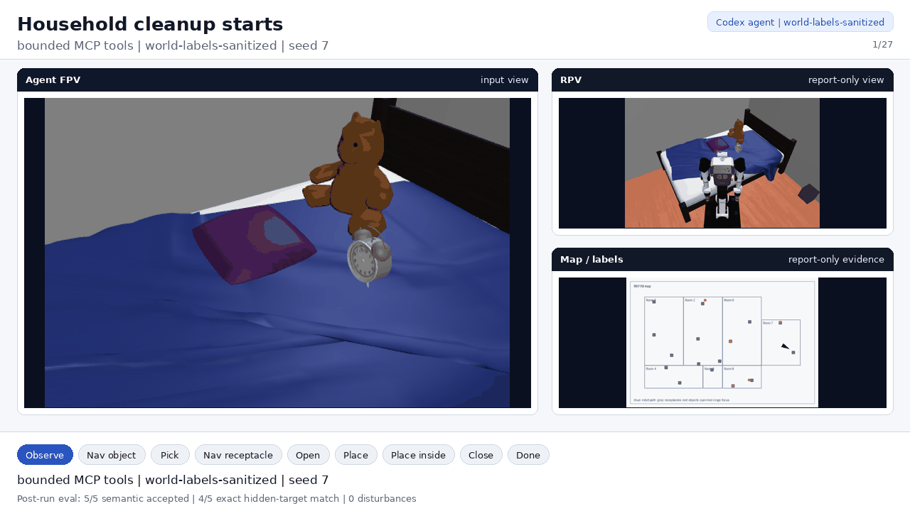
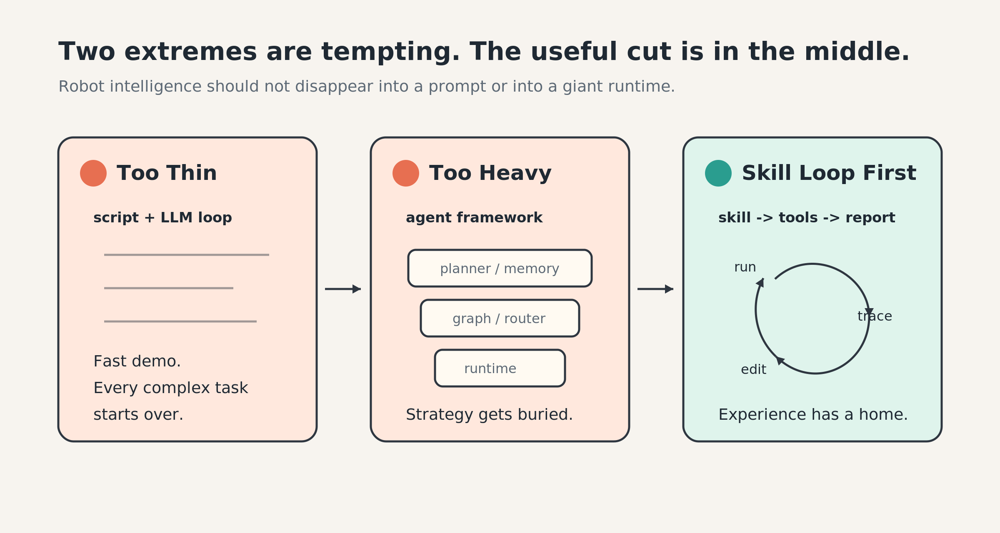
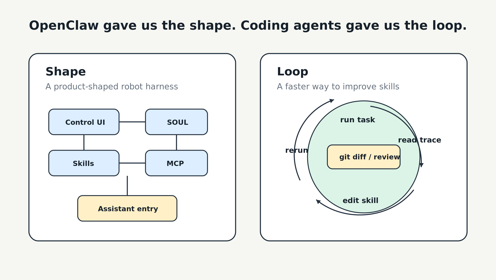
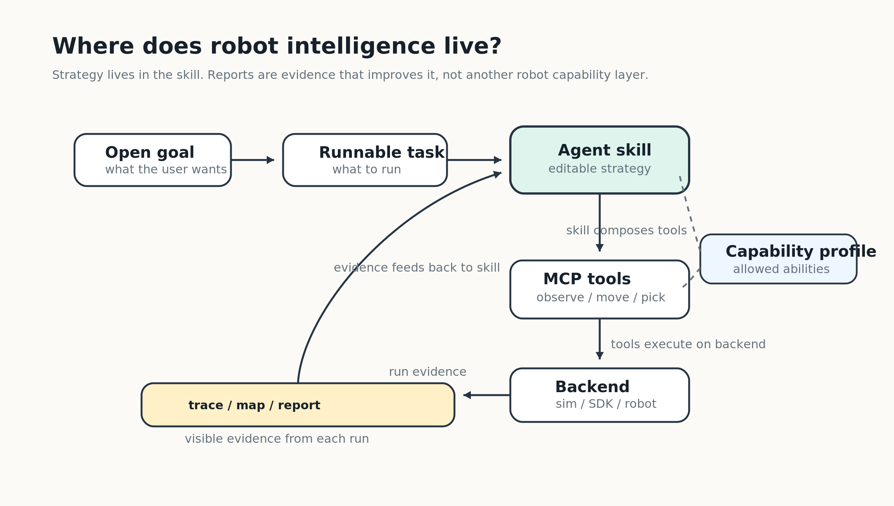
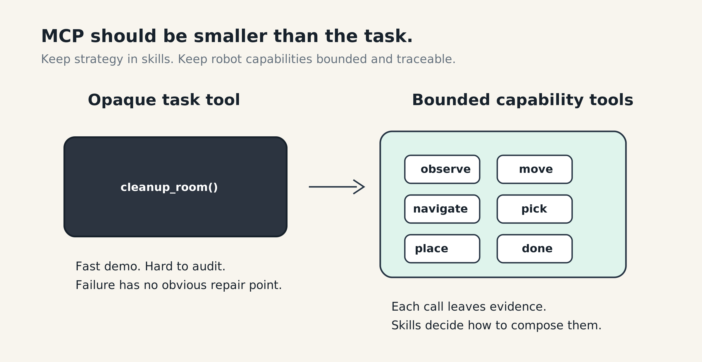
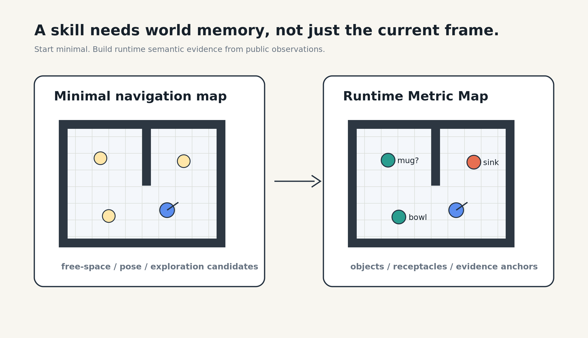
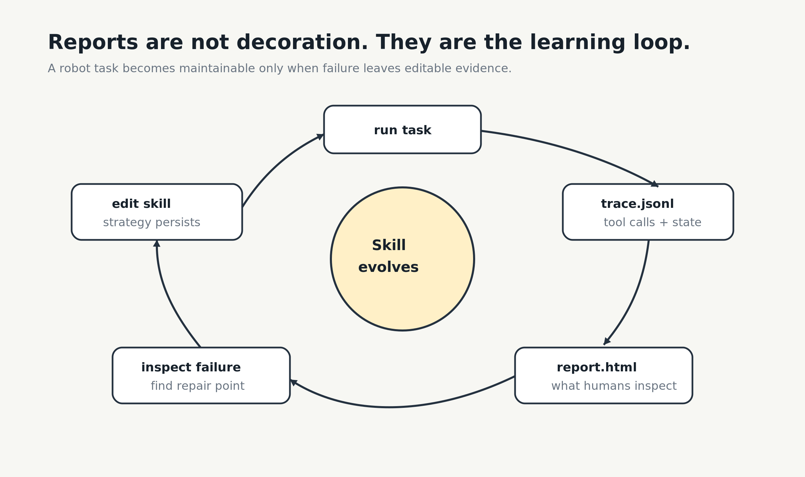
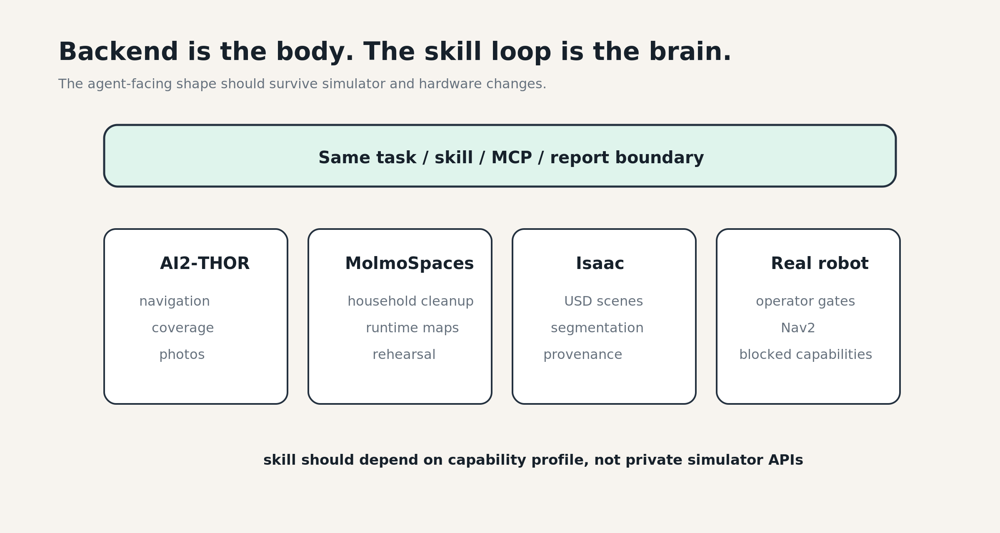

# Bring Brain to Robots: How Hard Can It Be?

> **Why coding agents may be the simplest baseline for robot intelligence**  
> **为什么 coding agent 可能是机器人智能最简单的起点**

看 *Top Gear* 时，我最喜欢 Clarkson 把一件显然会出事的事说得特别轻松：

> “How hard can it be?”


这句话好笑，不是因为它真的简单，而是因为大家都知道后面多半会冒烟、卡住、掉零件。但它也有一种很工程师的直觉：这个东西看起来能跑，我们知道会踩坑，所以先把车开起来，看看它到底会坏在哪里。

最近我们做 Roboclaws，经常也会有这种一边知道会翻车、一边还是忍不住想试的感觉：给机器人接个“大脑”，how hard can it be?

有了大模型之后，整个社区对“AI 控机器人”这件事的直觉都变了。以前我们会问：模型能不能看懂画面？能不能规划动作？能不能调用工具？能不能写代码？现在这些问题的答案都越来越接近 “yes”。VLM 能看图，LLM 能调工具，coding agent 能读代码、跑命令、改文件，MCP 又给了大家一个很自然的工具协议。

于是问题就变成了：

> 把这些东西接到机器人上，How hard can it be?

一开始我们也是这么想的。让机器人动起来并不难。至少 demo 级别不难。让一个模型看一帧画面，输出 `MoveAhead`、`RotateLeft`、`PickObject` 这类动作，也不难。把一个 simulator 包成 MCP server，让 Claude Code 或 Codex 调工具，也不难。

真正难的是另一件事：

**怎样让机器人持续完成开放式任务？**

不是“向前走一步”，而是：

> “把这个房间整理一下。”  
> “给所有椅子拍照。”  
> “先探索这个空间，再告诉我哪些东西可以清理。”  
> “如果失败了，下一次要变得更好。”

这类任务要求机器人不只是会发动作。它需要知道自己有哪些能力，需要理解当前世界，需要选择策略，需要留下证据，需要从失败里复盘，需要把经验沉淀下来，还要能迁移到不同 simulator、不同 backend，甚至真实机器人上。

这才是 Roboclaws 这段时间真正想回答的问题：

> **我们到底怎样给机器人以大脑？**

现在我们的答案越来越清楚：

```text
code-agent first
skills first
MCP bounded
harness verified
```

先看一眼这条路线跑起来是什么样：



这不是一个单步 pick-place demo，而是一整次 household cleanup replay：Codex agent 先通过公开 waypoints 做 observe sweep，再逐个调用 bounded MCP tools 完成 `navigate -> pick -> place`。FPV 是 agent-facing view；RPV / map 是 report-only evidence；最后分数是 post-run evaluation，不是 agent 输入。

真正重要的不是某一个动作，而是这条链路的形状：coding agent 作为研发 baseline，skill 承载策略，MCP tools 收敛机器人能力边界，trace、map 和 report 让每一次运行都能被复盘、被改进。

这不是唯一的路线。但这是我们目前找到的最直观、最简单、也最可扩展的切面。



---

## 1. 太薄：LLM loop 可以 demo，但经验留不下来

Roboclaws 最早的形态很直接：让 VLM 看机器人画面，然后输出动作。

在 AI2-THOR 里，我们可以把当前状态渲染成第一视角图像、地图、agent 位置、可见物体、已访问区域，再把这些信息喂给模型，让它选择下一步动作。多个 agent 可以同时跑，有的负责覆盖房间，有的做 territory game，有的比较不同模型的决策差异。

这种方式非常适合做 demo，也非常容易让人误以为问题已经解决了。

反馈快，改 prompt 快，接新模型也快。你可以在一个下午里看到机器人真的动起来：它会转身，会避障，会尝试靠近目标，会在房间里探索。作为第一步，这很重要。因为如果连这个都跑不起来，后面所有关于“智能”的讨论都只是空谈。

但我们从一开始也很清楚，这不是最终答案。

原因不是模型不够聪明，而是这个系统太薄了，薄到像只有一层 prompt 贴在 robot API 上。一个脚本加一个 LLM loop，可以证明模型能控制机器人，但一旦任务复杂起来，每次都像从头做。模型要重新理解任务、重新发现策略、重新试错。你发现“它应该先扫描房间再行动”，就去改 prompt。你发现“它总是在某个角落卡住”，就再加一条规则。你发现“拍照任务应该先列出所有目标”，就再改一次 system prompt。

这些改动当然有效，但它们不是一个真正的技能系统。它们没有被独立管理，没有被清楚测试，也很难被其他入口复用。

这时候我们意识到，真正的问题不是模型能不能控制机器人，而是：

> 机器人完成任务的经验，应该放在哪里？

如果它只放在 prompt 里，系统会越来越脆。  
如果它只放在 backend 代码里，智能会被藏进工具。  
如果它只存在于某一次对话里，下一次就会丢失。

---

## 2. 太重：agent stack 看起来完整，但智能容易藏起来

脚本加 LLM 太薄，这个问题很好理解。

但另一个极端更隐蔽，也更容易发生。

既然 LLM 很强，那我们是不是应该搭一个完整的 agent stack？Planner、memory、reflection、workflow graph、tool router、task queue、UI、权限、执行器，一层一层都加上。这张清单看起来很专业，也很容易让项目突然长出很多层。LangChain、LangGraph、Smolagents 这类框架出现以后，这个方向变得很自然。大家会不自觉地想：机器人这么复杂，当然需要一个更大的 agent framework。

这个冲动也合理。

开放式任务确实需要状态，需要工具，需要恢复，需要长程计划，需要观察和反馈。但如果我们一开始就从大 agent framework 出发，很容易把问题做复杂。任务策略到底在哪里？在 planner 里，在 memory 里，在 workflow graph 里，还是在某个工具实现里？失败以后应该改哪里？人和 coding agent 能不能看懂、修改、复用？

机器人任务会把这个问题放大。

因为机器人不是只生成文本。它要看见东西，移动到位置，判断自己是否到了，处理地图和遮挡，区分 public evidence 和 private evaluator truth，还要诚实说明哪些能力是真的，哪些只是 simulator helper，哪些还没有在硬件上证明。

所以我们不想从一个大框架开始。特别是在今天这个有点 token maxxing 的阶段，上下文窗口越来越长，工具也越来越容易堆，最危险的冲动就是：自己也去造一个轮子。

我们想从一个更小、更可审计、更容易被修改的单位开始。

---

## 3. OpenClaw gave us the shape

这也是 Roboclaws 这个名字的来源之一。

我们最初自然地看向 OpenClaw。它不是一个低层机器人 SDK，而是一个 high-level AI harness：有 Skills，有 SOUL，有 MCP，有 UI，也有长期运行的 daemon 和面向用户的 assistant 入口。

做机器人研发的人很自然会想：那我们把机器人接进去，是不是就行了？这个直觉是对的。

如果目标是“给机器人接一个大脑”，机器人就不应该只暴露一组底层动作。它应该被接进一个更高层的 agent harness：用户可以和它说话，agent 可以选择 skill，skill 可以调用 tools，运行过程可以被观察，结果可以被展示。

所以我们把 AI2-THOR navigator 包成 skill，通过 OpenClaw Gateway 接进来。这样研发人员可以在浏览器里看到机器人画面，一边看一边对 agent 说话。比如机器人卡住了，可以直接告诉它：“先左转，再往前走。” 比起停掉脚本、改 prompt、重新跑，这种交互形态自然很多。更重要的是，这组最小 MCP tools 已经足够支撑导航、拍照、覆盖和 cleanup 这些不同任务的早期实验。

这一步让我们确认了一件事：

**机器人需要的不是更多裸动作，而是更高层的 harness。**

但真正开始做开放式任务以后，我们又撞到了另一个问题。

---

## 4. Coding agents gave us the loop

我们最开始并没有意识到自己需要一整套 trace、report、skill edit、rerun 的循环。

最早的想法很朴素：和 Claude 讨论一下，写一个最小 MCP server，再写一个最小 Skill，把它交给 OpenClaw，让它去执行比较开放的任务。

它确实能跑。

然后很快开始露馅：跑得慢，效果也不稳定。这个时候我们需要手动改 MCP、改 Skill、改任务输入，因为 agent 能看到的上下文和能调用的工具就这些。问题是 OpenClaw 的抽象层级比较多，可观测性不是最容易加的东西。调试和优化起来，没有我们想象中简单。

后来真正跑得最快的循环，反而来自 Claude Code、Codex 这类 coding agent：

```text
run task
-> read trace
-> inspect report
-> edit skill
-> adjust MCP boundary or checker
-> rerun
-> keep the improvement
```

这就是我们现在那句判断：

**OpenClaw gave us the shape. Coding agents gave us the loop.**

OpenClaw 很适合做用户交互、UI、长期 daemon、语音入口和产品形态。Coding agent 更适合做研发循环：读文件、改 skill、跑任务、看 trace、复盘失败，再把经验写回 repo。

这不是替代关系。

更像两层：OpenClaw 是产品入口，coding agent 是 brain workshop。



---

## 5. Everything is a skill

到这里，我们才意识到，很多看起来像 agent framework 的问题，其实是 skill issue。这句话听起来像玩笑，但跑多了会越来越认真。

这也呼应了 Andrej Karpathy 在 No Priors 那期访谈里的说法。那期叫 *Andrej Karpathy on Code Agents, AutoResearch, and the Loopy Era of AI*，讨论 coding agents、AutoResearch，以及 AI 时代很重要的 skills。Karpathy 把多 coding-agent session、agent harness、instructions optimization 这些问题，归结成一句很工程师的话：everything is skill issue。[^nopriors]

这是一个很好的 framing：

当 agent 能力突然变强以后，瓶颈不一定是模型有没有能力，而是人和系统有没有把任务组织成它能稳定执行、验证、复用、改进的技能形态。

这对机器人尤其重要。

如果 everything is a skill，那 skill 就不能只是一个 prompt 文件。

在 Roboclaws 里，skill 是开放式任务经验的承载层：

- 任务怎么拆；
- 先观察什么；
- 什么时候建图；
- 什么时候导航；
- 什么时候调用 pick / place；
- 失败以后怎么恢复；
- 哪些 evidence 必须写进 report；
- 哪些能力只是 simulator helper；
- 哪些信息不能泄漏给 agent。

这些东西不应该散落在 prompt template、Python loop、backend adapter、UI 状态机，或者某次临时对话里。

它们应该进入一个可以被人类和 coding agent 共同维护的 artifact。

Roboclaws 现在的抽象很简单：

```text
open-ended goal
  -> runnable task
  -> agent skill
  -> capability profile
  -> MCP capability tools
  -> backend variant

each run
  -> trace / runtime map / report
  -> skill update
```

Runnable task 负责“这次要跑什么”。Skill 负责“怎么做”。Capability profile 说明 skill 可以依赖哪些能力。MCP tools 暴露稳定的机器人能力边界。Backend variant 决定具体在哪个 simulator、SDK 或机器人上执行。Trace、map 和 report 不是另一层能力，而是每次运行之后回流到 skill 的证据。

这个分层的目的不是好看。

它回答的是一个更根本的问题：

**机器人智能应该被放在哪里？**

我们的答案是：放在 skill loop 里。



---

## 6. MCP bounded

如果 skill 承载策略，MCP 就不应该吞掉整个任务。

一个很诱人的工具是：

```text
cleanup_room()
```

agent 调一次，房间整理完。demo 很快，接口很漂亮。

但这样智能就被藏起来了。agent 不知道中间发生了什么，人类也很难审计。失败以后，我们不知道应该改 skill、改 tool、改 perception、改 map，还是改 backend。

Roboclaws 更倾向于 bounded capability tools：

```text
observe
move
navigate
pick
place
open
close
done
metric_map
```

这些工具不是完整任务，而是稳定、可审计、可替换的能力边界。

仿真里当然有很多方便工具，比如完整 object inventory，或者直接 teleport 到目标旁边。它们可以帮助 demo、debug 和 smoke test，但必须诚实标注为 privileged helper。真实机器人默认没有上帝视角，也不能直接传送。

工具越大，demo 越快。

边界越清楚，智能越可迁移。



---

## 7. Harness verified

机器人任务不能只靠当前一帧画面，也不能像写完 TODO 一样只输出一句 “done”。

“给椅子拍照”已经需要目标列表、导航状态、相机朝向和照片证据。

“整理房间”更复杂。机器人需要知道哪些区域可以走，哪些地方值得探索，刚刚观察到了哪些物体，哪些 receptacle 可以作为 destination hint，哪些 prior 需要当前确认，哪些 map update 只是候选，不能直接写回 source map。

开头那段 cleanup replay 背后，靠的就是这套 artifact 边界：agent 看到的是公开观察和工具返回；report 可以展示 RPV、map 和 post-run score，但必须标清楚它们是 evidence，不是 agent 输入。

这就是 Runtime Metric Map 的意义。

我们不想一开始就给 agent 一张手写、完整、干净的 semantic map。真实机器人通常也不会有这种地图。

更现实的起点是 minimal map，类似于 ROS2 nav map，或者很多家机器人会默认提供的一层抽象：

- occupancy / free-space；
- pose / frame metadata；
- safety bounds；
- generated exploration candidates。

然后让 `semantic-map-build` 通过公开观察逐步构建 Runtime Metric Map。`household-cleanup` 再消费这份 evidence。

这样，skill 不只是在调用动作接口。它是在通过观察建立世界状态，再基于世界状态执行任务。

如果 skill 解决的是“怎么做”，Runtime Metric Map 解决的是“我现在知道这个世界什么”。



但 map 还不够。

机器人系统最危险的地方，不是失败，而是假装成功。所以每次 serious run 都应该留下足够证据：

```text
trace.jsonl
agent_view.json
run_result.json
runtime_metric_map.json
report.html
```

这些 artifact 不是为了好看。

它们是 skill 进化的燃料。没有 trace，coding agent 不知道哪里失败。没有 report，人类不知道这次结果能不能相信。没有 public/private boundary，系统不知道自己有没有作弊。没有 map，agent 就不能把一次观察变成下一次行动的世界记忆。

这也是为什么我们说 harness verified。

Harness 不是外围工程。对于 robot brain 来说，harness 本身就是智能的一部分。



---

## 8. Backend 是身体

当 skill、MCP、runtime map 和 report 的边界稳定以后，backend 就可以替换。

AI2-THOR 可以证明导航、覆盖、拍照。MolmoSpaces / MuJoCo 可以证明 household cleanup。Isaac 可以提供更真实的 USD scene、camera、segmentation、robot-view evidence。Agibot G2、ROS2/Nav2 或其他机器人，也可以作为 physical backend variant 接进来。

关键不在于“支持了多少 backend”。

关键在于：

**backend 是身体，skill loop 才是 brain。**

同样是 `semantic-map-build`，后面可以是 simulator，也可以是真机。

同样是 `household-cleanup`，后面可以是 MuJoCo，也可以是 Isaac，也可以是未来真实 robot backend。

同样是 skill，它应该依赖 capability profile，而不是直接学习某个 simulator 的私有 API。

同样是 report，它应该清楚告诉我们这次 evidence 来自哪里，哪些能力是真的，哪些能力仍然 blocked。

真机当然会带来更多边界：安全门、定位、地图、感知失败、运动控制、急停、operator gate。这些都不能被忽略。但它们应该进入 backend provenance 和 report evidence，而不是污染 agent-facing task 的形状。



---

## How hard can it be?

回到标题。

给机器人加 brain，第一步确实没有想象中难。

难的是不要走向两个极端。

太薄的 LLM loop，让每次任务都像从头做。太重的 agent framework，又容易把智能藏进 runtime，最后没人知道经验到底沉淀在哪里。

Roboclaws 现在更相信一个中间路线：把开放任务组织成 skill，让 coding agent 在 bounded MCP tools 上运行，把每次结果变成 trace、runtime map 和 report，再用这些证据改下一版 skill。

这条路线不神秘，也不玄学。

它只是把机器人智能放在一个能运行、能失败、能留下证据、能被修改、能再次运行的地方。

不是先造一个更大的 agent framework。

也不是把任务藏进一个万能 tool。

而是从 skill loop 开始，让经验真的能留下来。

**How hard can it be?**

比想象中难。但也比想象中更清楚。

当然，做到 90% 之后，我们还有 90% 的事情要做。😂

项目代码在 GitHub: [MiaoDX/roboclaws](https://github.com/MiaoDX/roboclaws)。

如果你也关心机器人、agent skill、MCP，或者怎么让 embodied AI 的运行过程真的能被复盘，欢迎来 GitHub 给 Roboclaws 点个 star，也欢迎开 issue 或加微信一起聊。

接下来我们会继续试一试基于 agent SDK 的更 clean surface。我们不太想再造一个新的 agent framework / harness；但把机器人任务整理成更清楚、更可组合、也更容易留下证据的能力边界，这件事我们觉得还挺值得继续尝试。

[^nopriors]: No Priors, “Andrej Karpathy on Code Agents, AutoResearch, and the Loopy Era of AI,” published March 20, 2026. Public transcript: [spoken.md](https://spoken.md/episode/andrej-karpathy-on-code-agents-autoresearch-and-the-1000756334966). Public episode/X references: [Podchaser](https://www.podchaser.com/podcasts/no-priors-artificial-intellige-5096296/episodes/andrej-karpathy-on-code-agents-288350765) and [Sarah Guo post](https://x.com/saranormous/status/2035080458304987603).
