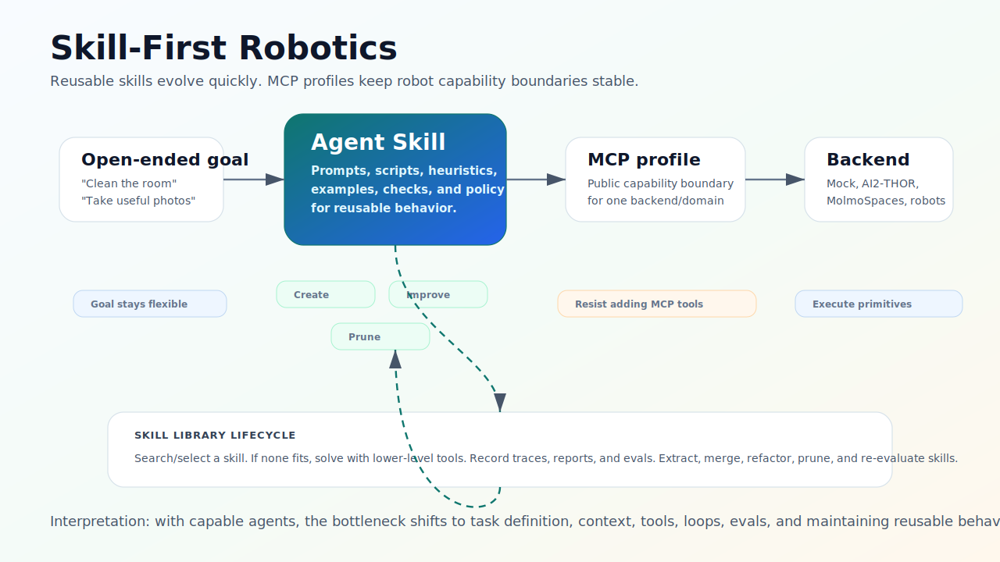
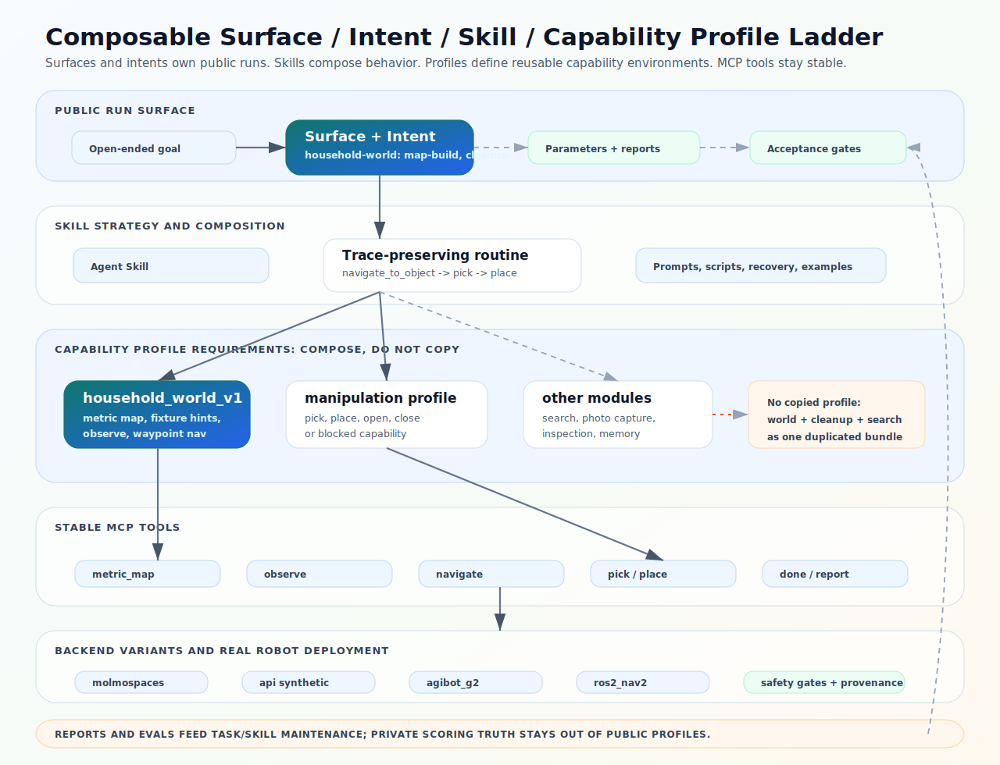

# Skill-First MCP Architecture

The root [`README.md`](../../README.md) owns the big-picture MCP and skill
design principles. This note is the companion reference for how Roboclaws
connects agent skills, MCP tools, semantic robot capabilities, and execution
backends without making teammates read the GSD phase logs.





## Reference Summary

Roboclaws uses a **skill-first, MCP-bounded** architecture:

1. A user gives an **open-ended goal**, such as "clean the room" or "take
   useful photos."
2. The agent searches for, uses, or creates an **agent skill**.
3. The skill may call scripts, examples, checks, and MCP tools.
4. The **MCP profile** keeps the public robot capability boundary stable.
5. The execution backend runs environment-specific primitives.
6. Reports and evals feed the skill library lifecycle.

The design bias is to keep reusable behavior in skills and to resist adding
new MCP tools unless the behavior clearly belongs in the robot capability
contract.

This aligns with the "skill issue" framing discussed by Andrej Karpathy on
[No Priors](https://www.youtube.com/watch?v=kwSVtQ7dziU): with capable agents,
the bottleneck shifts to how well we define tasks, give context, build tools,
run loops, evaluate outputs, and maintain reusable agent behavior. Roboclaws
applies that idea to robotics by letting skills evolve while MCP profiles stay
bounded and auditable.

## Abstraction Ladder

Build from the bottom up, but let the agent enter from the top:

| Level | Owns | Examples | What to watch |
| --- | --- | --- | --- |
| Open-ended goal | Human intent | "clean the room", "inspect this room" | Do not turn this into one opaque MCP tool. |
| Agent skill | Reusable behavior package | `capture-object-photo`, `cleanup-generated-mess` | Skills can evolve, merge, split, and be pruned. |
| Trace-preserving skill routine | Skill-side reusable execution shape | scripted cleanup loop, `locate -> navigate -> observe_archived` | Default home for reusable composition before MCP promotion. |
| Composite action | Describes a skill's internal behavior shape | `locate -> navigate -> observe_archived` | Descriptive by default, not a separate artifact. |
| Composed semantic capability | Bounded capability or service | localization, navigation, search, transport | Promote only when the boundary is stable. |
| Atomic semantic capability | Small public robot action | observe, move, turn, pick, place, open, close | Prefer these for MCP capability contracts. |
| Environment primitive | Backend-specific implementation | AI2-THOR step, MuJoCo actuation, robot API call | Not agent-facing by default. |
| Execution backend | Actual environment | mock, AI2-THOR, MolmoSpaces, Unitree G1, RBY1M, AGIbot G2 | Backends differ; profiles should not pretend otherwise. |

`capture_object_photo(object)` is a good example: maintain it as an agent skill
with a script by default. Internally, it may perform a composite action such as
`locate -> navigate -> orient -> observe_archived -> verify`. It should not
become an MCP tool unless several skills need the same stable capability and
the public trace semantics are clear.

## Skill Library Lifecycle

Skills are where reusable behavior evolves:

```text
Open-ended goal
  -> search/select existing skill
  -> if no good skill exists, solve with lower-level tools
  -> record trace/report/eval
  -> extract or improve reusable skill behavior
  -> periodically refactor, merge, prune, and re-evaluate skills
```

The skill layer can hold long-running behavior, prompt strategy, scripts,
examples, checks, and maintenance notes. It is the right home for task-like
behavior such as photo capture, generated-mess cleanup, grocery placement, or
room inspection.

MCP is different: it is the public robot capability boundary. A skill can call
many MCP tools, but the skill itself is not automatically a robot capability
claim.

A **trace-preserving skill routine** is the preferred first shape for repeated
composition. It can use scripts, evals, structured output, and explicit recovery
while still leaving MCP bounded to public capabilities. If a routine is later
promoted into MCP, the skill should stop duplicating the lower-level call chain
and call the promoted capability instead.

## Skill Manifests

Maintained skills include a small `skill.json` manifest next to `SKILL.md`.
The manifest is not another runtime API. It is a human/test-readable contract
for the skill library:

- which MCP profiles the skill expects;
- which tools are required, optional, or privileged;
- which scripts belong to the skill;
- which artifacts count as evidence;
- when to refactor the skill or promote behavior into MCP.

This keeps reusable behavior shareable without hiding task strategy inside the
core MCP server. See `skills/README.md` for the manifest fields.

## MCP Promotion Rule

Resist adding MCP tools by default. Promote behavior from a skill or script
into an MCP tool only when all of these are true:

1. Multiple skills need it.
2. Inputs and outputs are stable for one contract profile.
3. It has traceable substeps or a clear atomic meaning.
4. It uses only public allowed information.
5. It belongs in the robot capability boundary, not just agent strategy.

For example, `observe_archived(label)` belongs in MCP because it is a stable
observation capability with clear artifact output. A photo-capture routine
usually belongs in a skill because it is task strategy.

Promoted composite tools should be rare enough that an empty promoted-tools
surface is the normal state. A non-empty promoted surface should mean the
composition has become a backend-enforced, cross-client capability contract, not
merely a faster way to call several tools.

## Composite Actions and Privileged Tools

A **composite action** is an honest behavior shape built from lower-level
semantic capabilities. It records or preserves its substeps. It is descriptive
by default, not a separate maintained artifact.

A **privileged tool** is a non-canonical tool that uses information or execution
power a robot would not generally have. Privileged tools can stay useful for
demos, debugging, smoke tests, or proof loops, but they must not be treated as
canonical robot capability claims.

Examples:

| Behavior | Classification | Why |
| --- | --- | --- |
| `capture_object_photo(object)` | Agent skill with a composite action inside | It combines locate, navigation, observation, and verification. |
| `put_in_refrigerator(object)` | Skill or composite action, depending on packaging | It can be decomposed into navigate, open, place, close. |
| Selected-object cleanup transport | Agent skill routine | The cleanup skill composes `navigate_to_object -> pick -> navigate_to_receptacle -> open? -> place/place_inside -> close?` through public atomic tools. It remains skill-side unless promotion criteria are met; it is not exposed as a default MCP tool. |
| `scene_objects()` | Privileged tool | It exposes full AI2-THOR object inventory. |
| `goto(object_id)` | Privileged tool unless decomposed | The current AI2-THOR version is target-relative teleport-style help. |
| Hidden acceptable-destination lookup | Privileged/private evaluator data | It must never enter public profile metadata. |

## Current Profiles

### `ai2thor_navigation_v1`

Canonical public capability tools:

- `observe`
- `observe_archived`
- `move`
- `done`

Privileged tools:

- `scene_objects` is an AI2-THOR object-inventory oracle.
- `goto` is a target-relative teleport-style helper.

Those tools are disabled on the default server surface. A photo/demo launcher
must opt in explicitly when it needs the AI2-THOR inventory oracle or
target-relative teleport helper. They are not presented as real robot perception
or real robot navigation capabilities.

### `molmospaces_cleanup_v1`

Canonical public capability tools include the ADR-0003 cleanup surface:

- public map and fixture context;
- waypoint/object/receptacle navigation;
- public observation and inspection;
- pick/place/open/close operations;
- episode completion.

The profile is public-agent metadata only. It must not expose generated mess
sets, acceptable destinations, private manifests, hidden target lists,
`is_misplaced`, private scoring truth, or AI2-THOR object inventory helpers.

### `real_robot_cleanup_v1`

The first physical cleanup-facing profile keeps the cleanup-shaped public tool
list but narrows executable capability to navigation and perception. The
backend is `physical_robot` with backend variants currently represented by
`nav2_ros2` and `agibot_gdk`; both variants preserve the same public tool names.

- `metric_map` returns backend-neutral public map semantics. Nav2-backed runs
  derive this from a Nav2-shaped map bundle; Agibot-backed runs derive it from
  an SDK-exported agent view generated from operator-authored map context.
- `fixture_hints` returns authored static fixture semantics and preferred
  waypoints without exposing backend map ids or private cleanup truth.
- `navigate_to_room`, `navigate_to_waypoint`, `navigate_to_visual_candidate`,
  `navigate_to_object`, and `navigate_to_receptacle` resolve cleanup goals to
  bounded physical navigation actions when enough public grounding is available.
  Current provenance may be `nav2_action`, `agibot_gdk_normal_navi`, or
  `blocked_capability`.
- `observe`, `adjust_camera`, `declare_visual_candidates`, and
  `inspect_visible_object` stay grounded in robot-camera artifacts.
- `pick`, `place`, `place_inside`, `open_receptacle`, and `close_receptacle`
  are present only as structured `blocked_capability` responses until physical
  manipulation is proven.

This profile exists so reports can distinguish
`physical_navigation_pilot=true` from `physical_cleanup_ready=false`. Agibot
runs additionally render SDK-owned subphase reports for agent-view export,
policy observation, and waypoint navigation, keeping GDK-specific execution
evidence outside the Roboclaws Python runtime.

## Design Considerations

### Keep Profiles Backend/Domain Specific

There is no premature universal robot API here. A navigation-only AI2-THOR
profile and a cleanup-oriented MolmoSpaces profile can share capability-family
names while exposing different tools.

Future profiles can combine environment and task domain, for example:

- `ai2thor_photo_v1`
- `molmospaces_camera_cleanup_v1`

### Keep Planning in the Agent and Skills

The model should plan over capabilities. Skills should capture reusable
behavior. MCP should expose bounded abilities and semantic services, not
whole-goal tools like `cleanup_room()`.

This keeps behavior inspectable: the report can show the steps the agent or
skill chose instead of hiding the work behind one tool call.

When a cleanup or photo routine becomes repetitive, first make it a
trace-preserving skill routine with tests and report evidence. Promote it into
MCP only when the composition itself must be discoverable, schema-validated,
and enforced across clients or backend variants.

### Prefer Forward-Only Cleanup

Profiles define the current public surface. When a profile replaces an older
server, recipe, or skill shape, update in-repo callers and remove the stale
surface instead of keeping compatibility shims. Historical report rendering can
keep reading archived artifacts, but active MCP and skill entrypoints should
live at the current profile head.

## How a Request Flows

```text
Open-ended goal
  -> skill library search / skill creation
  -> selected skill calls scripts and MCP tools
  -> semantic profile constrains public capabilities
  -> execution backend runs primitives
  -> trace/report/eval feeds skill maintenance
```

For AI2-THOR photo tasks, the `capture-object-photo` skill may use
`scene_objects` and `goto` only when the launcher has enabled privileged
helpers. The semantic profile still records that these are privileged tools,
not general robot capabilities.

For Molmo cleanup, the profile keeps the public cleanup surface separate from
private scoring and planner proof evidence. A clean report can therefore be
honest about whether the result is `api_semantic`, `planner_backed`, or
`blocked_capability`.

## Adding a New Profile

When adding a profile, start from the capability contract, not the skill:

1. Name the backend/domain profile, such as `<environment>_<task-domain>_v1`.
2. List capability families: perception, localization, mapping, navigation,
   manipulation, memory, and episode.
3. List canonical public tools.
4. List privileged tools separately.
5. List private terms that must never appear in public metadata.
6. Add contract tests that prove profile validation fails closed.
7. Update the relevant human doc if the new profile changes how teammates
   should reason about the system.

Do not add a new profile just to rename a demo recipe or skill. Demo recipes
choose how to run a scenario; skills own reusable behavior; semantic profiles
describe what public robot capabilities the agent is allowed to rely on.

## Where to Look in the Repo

| Need | File |
| --- | --- |
| Profile declarations and built-ins | `roboclaws/mcp/profiles.py` |
| Generic profile router helper | `roboclaws/mcp/entrypoint.py` |
| AI2-THOR navigation MCP server | `roboclaws/mcp/server.py` |
| Molmo cleanup MCP server | `roboclaws/molmo_cleanup/realworld_mcp_server.py` |
| Skill library convention | `skills/README.md` |
| AI2-THOR agent skill | `skills/ai2thor-navigator/SKILL.md` |
| Photo capture skill | `skills/capture-object-photo/SKILL.md` |
| ADR-0003 Molmo cleanup skill | `skills/molmo-realworld-cleanup/SKILL.md` |
| Profile/router contract tests | `tests/contract/mcp/test_semantic_profiles.py` |
| Skill manifest tests | `tests/contract/skills/test_skill_manifests.py` |
| Skill-first hero diagram | `docs/human/skill-first-robotics.svg` |
| Shareable architecture diagram | `docs/human/mcp-skills-and-semantic-profiles.svg` |

Planning artifacts for Phase 136 explain the implementation history, but this
document is the human entry point for sharing the architecture with teammates.
