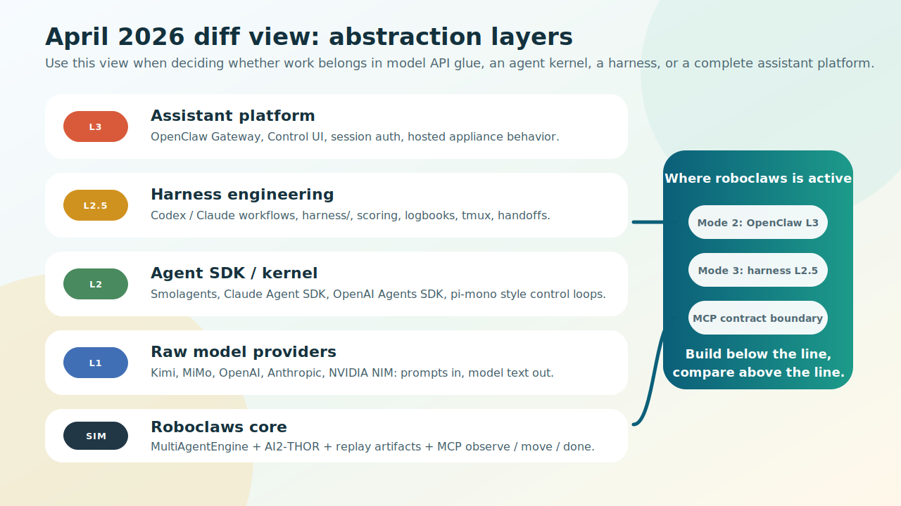
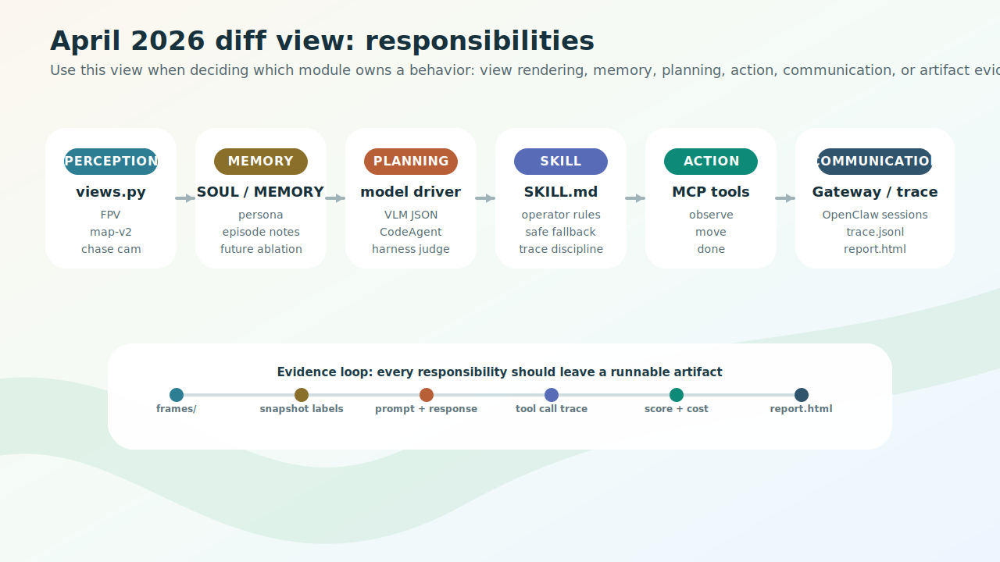
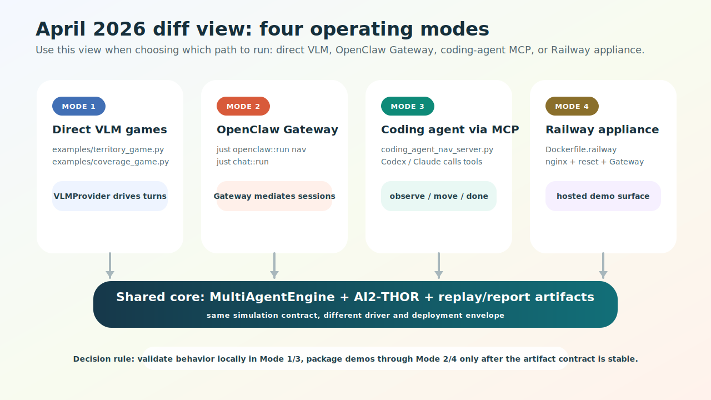
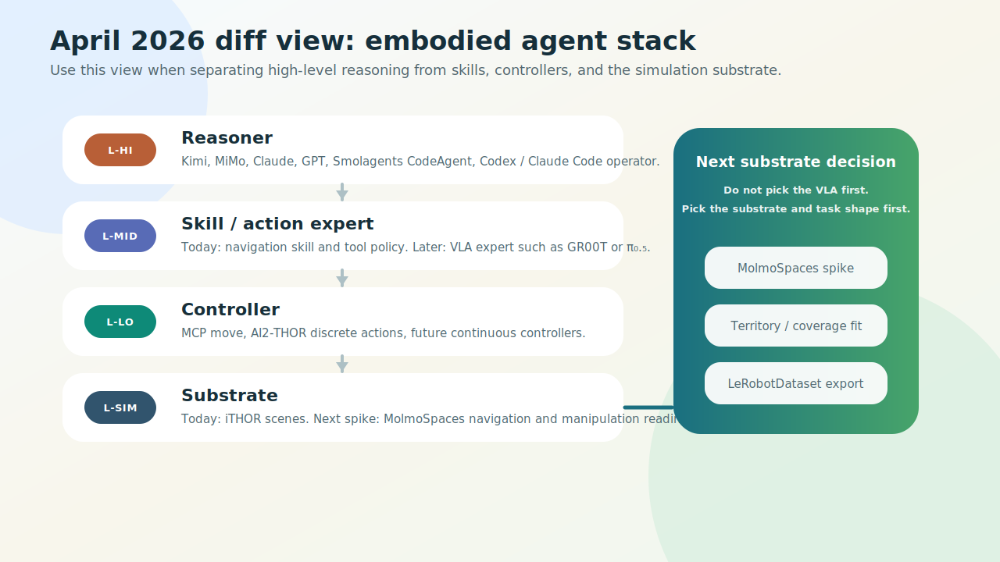

# roboclaws 生态调研：2026 年 4 月 Checkpoint

> 这是 `roboclaws` 项目对 OpenClaw 生态、agent 框架格局、具身 AI 栈的一次结构化调研存档。
>
> **当前 checkpoint 时间：** 2026 年 4 月 28 日
> **下次预定更新：** 2026 年 5 月底
> **维护方式：** 每月一次 deep research + 人工 review，见 §0.2

---

## 目录

- [0. 关于本文档](#0-关于本文档)
  - [0.1 为什么要做这个 checkpoint](#01-为什么要做这个-checkpoint)
  - [0.2 每月更新方法](#02-每月更新方法)
  - [0.3 信源质量与可信度声明](#03-信源质量与可信度声明)
  - [0.4 阅读指南](#04-阅读指南)
- [1. 执行摘要](#1-执行摘要)
- [2. 背景：roboclaws 现状与约束](#2-背景roboclaws-现状与约束)
- [3. OpenClaw 生态全景](#3-openclaw-生态全景)
  - [3.1 OpenClaw 与 Pi/pi-mono 的关系（一个常见误解的修正）](#31-openclaw-与-pipi-mono-的关系一个常见误解的修正)
  - [3.2 严格家族变体清单](#32-严格家族变体清单)
  - [3.3 相邻项目清单](#33-相邻项目清单)
  - [3.4 从变体格局浮现的 10 个稳定模式](#34-从变体格局浮现的-10-个稳定模式)
- [4. 分类法：4 个视角看同一个问题](#4-分类法4-个视角看同一个问题)
  - [4.1 视角 I：抽象层级](#41-视角-i抽象层级)
  - [4.2 视角 II：按职责](#42-视角-ii按职责)
  - [4.3 视角 III：按部署形态](#43-视角-iii按部署形态)
  - [4.4 视角 IV：具身 agent 栈](#44-视角-iv具身-agent-栈)
  - [4.5 4 个视角对比与组合使用建议](#45-4-个视角对比与组合使用建议)
- [5. 学术与产业的现成分类法](#5-学术与产业的现成分类法)
  - [5.1 学术综述](#51-学术综述)
  - [5.2 产业栈图](#52-产业栈图)
  - [5.3 机器人专属分层](#53-机器人专属分层)
- [6. 给 roboclaws 的具体建议](#6-给-roboclaws-的具体建议)
  - [6.1 按 phase 的取舍](#61-按-phase-的取舍)
  - [6.2 优先深读的项目](#62-优先深读的项目)
  - [6.3 工程上可以做的几件事](#63-工程上可以做的几件事)
- [7. 公开问题与下次 checkpoint 该回答什么](#7-公开问题与下次-checkpoint-该回答什么)
- [8. 变更日志](#8-变更日志)
- [附录 A：完整参考链接](#附录-a完整参考链接)
- [附录 B：术语表](#附录-b术语表)

---

## 0. 关于本文档

### 0.1 为什么要做这个 checkpoint

`roboclaws` 早期做选型时，我们在很短的时间内确定了"直接调 VLM API + OpenClaw Gateway + code agent"这三层栈。当时这个判断是合理的——在那个时间点上，能让多个 VLM 实例稳定驱动 AI2-THOR 仿真机器人的生产级方案就这么几个。

但是 agent 框架生态在 2025–2026 这一年是爆炸式增长的：

- 仅 OpenClaw 一个项目就衍生出 40+ 个 100+ stars 的变体，覆盖 8 种语言和 4 种部署形态；
- agent SDK 层（pi-mono、Claude Agent SDK、OpenAI Agents SDK、Smolagents 等）从无到有再到收敛，并且在 2026 年 Q1–Q2 显式形成了"harness engineering"这个具名学科；
- 机器人 VLA 栈（NVIDIA GR00T N1.7、Physical Intelligence π₀.₅、LeRobot）开始成为可即插即用的基础设施；
- MCP 在 2025 年 12 月被捐给 Linux Foundation，2026 年 3 月发布了正式路线图，已成为事实上的工具集成层；
- Allen AI 在 2026 年 2 月推出 MolmoSpaces，作为面向操作任务的下一代具身 AI 生态。

在这种节奏下，**任何"选型决定"都有保鲜期**。这个文档要做两件事：

1. **冻结当前时间点的认知**：把 2026 年 4 月这一刻我们对生态的理解、对 roboclaws 取舍的判断完整记录下来，包括*哪些是基于证据的结论*、*哪些是经验直觉*、*哪些是未来需要验证的假设*。
2. **建立可持续更新的机制**：让"每月调研一次"成为一种轻量、可重复、可验证的习惯，而不是每隔半年发现自己又落后了再做一次大调研。

文档不是结论，是**调研的快照**。每个 checkpoint 都应该可以独立读懂，但放在一起又能看出生态的演化轨迹。

### 0.2 每月更新方法

每月更新一次，节奏定在月底（每月最后一周）。每次产出一个新的 `YYYY-MM.md` 文件，与历史 checkpoint 并列保存，**不覆盖**——这样可以追溯任何一个判断是在什么背景下做出的。

每次更新跑下面这套流程：

**步骤 1 — 增量调研**

跑一组针对性的 deep research 查询，覆盖 5 个固定方向：

1. **OpenClaw 严格家族增量**：与上个 checkpoint 比，有哪些新出现的 100+ stars 变体？哪些消失了或停止维护？
2. **Agent SDK / Harness 层动态**：Anthropic Claude Agent SDK / OpenAI Agents SDK / pi-mono / Smolagents / LangGraph 这些这个月有什么 release 或方向变化？harness engineering 主线（Hashimoto / Anthropic engineering blog / OpenAI Symphony / Cursor）有什么新文章？
3. **VLA / 机器人栈动态**：GR00T、openpi、LeRobot、Isaac Lab、MolmoSpaces 有什么新版本？有没有新出现的开源 VLA？
4. **协议层**：MCP、A2A、ACP 这个月有没有规范变更或重要的新 server？特别关注机器人仿真的 MCP server。
5. **学术前沿**：arXiv 上"LLM agent survey"、"VLA survey"、"multi-agent embodied"过去 30 天有什么值得读的新综述？

**步骤 2 — 增量整理**

把调研结果对照上个 checkpoint，挑出 3 类需要更新的内容：

- **新增项目**：加到 §3.2 / §3.3 表格，标注 "(新增于 YYYY-MM)"。
- **状态变化**：原项目 stars 大幅变化（>30%）、改名、停止维护、被收购、关键人物离开——在原条目上加一个 `[YYYY-MM 更新]` 标注。
- **判断修正**：如果新证据让某个 §6 建议不再成立，**不要删除原建议**，而是在下面加一段 "[YYYY-MM 修正]" 说明为什么改变。这样后续读 checkpoint 的人能看出"我们是怎么改变想法的"。

**步骤 3 — 写新 checkpoint**

复制上个 checkpoint 作为模板，更新：

- 文件头的日期、下次更新日期；
- §1 执行摘要——重写，反映本月最重要的 3–5 个变化；
- §3 / §4 / §5 / §6 各章节——按步骤 2 的标注更新；
- §7 公开问题——勾掉本月已回答的，加上本月新发现的；
- §8 变更日志——新增一节 `## YYYY-MM-DD` 列出本次的所有变更。

**步骤 4 — Review 与 commit**

人工 review 整篇文档。重点检查：

- 有没有过度采信单一信源（特别是 SEO 内容站的判断）？
- 有没有"这个月没新东西所以照抄上月"的偷懒？
- §6 的建议有没有跟 §3–§5 的证据脱节？

review 通过后 commit 到 repo 的 `docs/research-checkpoints/` 目录。

**触发临时调研的条件（不等月底）：**

- 出现"模型代际跃迁"——新一代旗舰模型（如 Claude Opus 5、GPT-6、GR00T N2）发布；
- roboclaws 自身做出重大架构决策需要现场调研支撑；
- 某个我们已采纳的项目（如 MCP、OpenClaw、Anthropic Skills）发生重大变更（停维护、license 变更、安全事件、规范断裂）；
- 学术上出现 paradigm-shifting 的新工作（罕见，过去一年大概 2–3 次）。

### 0.3 信源质量与可信度声明

调研中遇到的信源大致分四档，引用时心里要分清：

**A 档（一手、可信）**：项目官方 GitHub repo、官方 blog（Anthropic、OpenAI、NVIDIA Developer、HuggingFace、Allen AI）、arXiv 论文、Linux Foundation 官方公告、维护者本人的技术博客（如 mitchellh.com）。这些可以直接引用，但仍需验证发布时间——arXiv preprint 不等于已发表，官方 blog 可能反映的是公关角度。

**B 档（二手、需交叉验证）**：技术媒体（The Information、TechCrunch、TheNewStack、InfoQ、SecurityWeek、VentureBeat）、独立工程师的对比博文、HackerNews/Reddit 讨论的高赞回答、产业咨询报告。这些通常方向对，但具体数字和时间线要核对一手信源。

**C 档（聚合站、谨慎使用）**：clawclones.com、shelldex.com、awesome-claws、awesome-physical-ai 这类聚合/对比门户。它们对**生态广度**的反映有用（"哦，原来还有这个项目"），但对**任何具体定量声明**（stars 数、安全 issue 数、市占率）都要按 ±20% 看待，且最好回到一手 repo 验证。

**D 档（SEO / 内容营销，多数不引用）**：vellum.ai、qubittool.com、composio.dev、scriptbyai.com、aimagicx.com、skywork.ai 这类站发布的"2026 年最佳 X 替代品"导购文章。它们的**结构化结论**（某种工具适合某种场景）有时有参考价值，但**具体声明**（性能数字、市场判断）几乎都是为 SEO 服务，**绝大多数情况下应该忽略**。如果某个判断只在 D 档信源里出现而无 A/B 档佐证，请在文档里标注 "[未充分验证]"。

**特殊提示**：本调研的执行时间是 2026 年 4 月，但很多被引用的文章发布日期标的是"2026"——这在中文/西方常规历法下显得"未来日期"。这不是错误，是 SEO 内容站常用的"提前年份化"策略。判断时以**实际发布时间戳**为准，不被标题里的年份带偏。

### 0.4 阅读指南

文档比较长，按你的目的选择切入点：

- **想快速了解结论**：读 §1 执行摘要 + §6 建议。
- **想理解 OpenClaw 生态全貌**：读 §3。
- **想思考架构怎么切**：读 §4。
- **想做选型决策**：读 §6 + §7。
- **想跟进学术前沿**：读 §5.1 + §5.3。
- **想做下一次 checkpoint**：读 §0.2 + §8 变更日志 + §7 公开问题，知道这次该补什么。

文档里使用的几个约定：

- **加粗**用于强调关键判断或项目名首次出现。
- *斜体*用于表示"产业内的术语"或"需要被定义的概念"。
- 反引号 `code` 用于文件名、API 名、命令行工具。
- 中英混排：技术术语保留英文（agent、harness、skill、SOUL、persona、channel、sandbox 等），它们在中文社区已是默认。
- "L-Hi / L-Mid / L-Lo / L-Sim" 是本文档自创的具身栈层级标签，仅在 §4.4 之后使用。
- "L1 / L2 / L3" 是早期讨论中提出的抽象层级标签，仅在 §4.1 使用。两者不冲突——它们是同一问题的两个不同视角。
- 术语表见附录 B。

**2026-04-30 整理说明**：本 checkpoint 里的可执行后续项已经同步到
[`TODOS.md`](../../TODOS.md) 的 "Research checkpoint 2026-04" 条目，方便后续
单独认领或并行推进。架构差异视图也已落到 SVG 文件，下面 §4 可直接作为
README / phase planning 的视觉索引。

## 1. 执行摘要

**生态层面的 6 个判断（基于本月 deep research）：**

1. **Harness engineering 在 2026 年 Q1 形成具名学科。** Mitchell Hashimoto 2 月初 "Engineer the Harness" → OpenAI 2-11 "Harness engineering: leveraging Codex" → Anthropic 一系列 engineering blog（"Effective harnesses for long-running agents"、"Harness design for long-running application development"、Managed Agents 4-08 公测）→ Cursor 1 月递归 Planner/Worker → OpenAI Symphony 4-27 → OpenAI Agents SDK 4-15 harness/sandbox 解耦更新。**roboclaws 现有的 Mode 3（code-agent-via-MCP + harness/）正好坐落在这条主线里**——这是当前栈最有战略价值的部分，下一版文档应作为架构中心而非附属。

2. **OpenClaw 的位置变了。** 项目仍然活跃（截至 v2026.4.25 约 36 万 stars、7.4 万 forks），但 2 月中旬创始人 Steinberger 加入 OpenAI、项目移交独立基金会（OpenAI 赞助）；Q1 出现了一次显著的安全事件（CVE-2026-25253 一键 RCE，已修补）；与 Anthropic 关系因商标争议变冷。**结论：不再是 Claude 阵营的项目，但仍是有效的多 channel + 持久 SOUL + 浏览器 Control UI 出口选项。** 把它当**并行 mode 之一**继续维护，不再当作战略 L3。

3. **Python 形态的 OpenClaw 后继者（Hermes / Nanobot / OpenHarness）都是单用户个人 agent 形态，不是多 session 仿真编排器形态。** 即使 Hermes 出货了 `hermes claw migrate` 迁移命令，也不是 roboclaws Mode 2 所需 gateway 角色的 drop-in 替代。所以"切换到 Hermes/Nanobot"这条路径在当前不成立——更现实的是保留现有 OpenClaw 路径，把架构重心放到 Mode 3。

4. **MolmoSpaces（Allen AI，2026-02）是接下来要走的方向。** 23 万+ 室内场景、13 万+ 物体、4200 万抓取标注，可 USD 导出到 MuJoCo / Isaac Lab+Sim / ManiSkill。配套 MolmoBot 演示了零样本 sim-to-real 操作。它构建在 Objaverse + THOR 家族之上，是 AI2-THOR 的精神继承者，且原生支持操作任务。**对 roboclaws 来说**：当任务从单纯导航/覆盖扩展到操作时（这一步即将到来），MolmoSpaces 是首选下一代 substrate。

5. **MCP 已成为事实上的工具集成层。** 2025-12 捐给 Linux Foundation Agentic AI Foundation；2026-03-09 发布正式路线图（传输可扩展性、agent 通信、治理、企业就绪）；多个机器人仿真 MCP server 已经存在（isaacsim-mcp、ros-mcp-server 等）。**roboclaws 的 MCP 服务器（127.0.0.1:18788/mcp，暴露 observe/move/done）作为模式不再 novel，作为多 agent 领地游戏的应用才是 novel。**

6. **多 agent + code-agent + sim 这条组合还没有公开发表的实例。** Cursor 的递归 Planner/Worker 是最近的概念祖先（多 coding agent 驱动单一目标——浏览器项目），但"多 coding agent 驱动多个仿真机器人"截至 2026-04-28 没有公开案例。**roboclaws 处于成为第一个实例的位置。**

**对 roboclaws 的 5 个具体建议：**

1. **保持 4 模式并存，把 Mode 3 提升为架构中心。** Mode 1（直调 VLM）、Mode 2（OpenClaw Gateway）、Mode 3（code-agent-via-MCP）、Mode 4（Railway appliance）各解不同的问题。Mode 3 + `harness/` 自我改进循环是当前最有战略价值的部分——它直接是 harness engineering 主线在机器人仿真上的应用，应当成为架构叙事的中心。

2. **下一代 substrate 计划：MolmoSpaces。** 当任务扩展到操作时（即将发生），从 AI2-THOR 迁移到 MolmoSpaces。理由：操作任务原生支持、场景规模大一个数量级、与 Allen AI 在 THOR 家族上的延续性、USD 管线给后续 Isaac/ManiSkill 兼容留了出口。Habitat 3.0 + PARTNR、ManiSkill3 暂时只列入 watchlist，不投入精力。

3. **Smolagents 作为第三方实验路径。** 把它定位在和 Anthropic Claude Agent SDK / OpenAI Agents SDK / pi-mono SDK 相同（或略上）的层级——code-as-action 范式是 Mode 3 的一种落地选择。计划做一次 Smolagents CodeAgent 在 AI2-THOR 上的实验，与现有 Mode 3 对比。

4. **SOUL.md / SKILL.md / MEMORY.md 约定继续保持。** 这套是免费的可移植性，2026-03-14 已被 Anthropic Skills 正式标准化（agentskills.io），跨 Claude Code / Cursor / Codex CLI / OpenClaw / Hermes / Nanobot / OpenHarness 互通。roboclaws 的 `skills/ai2thor-navigator/SKILL.md` 已经合标。

5. **架构文档同时给 4 个视角。** 抽象层级（L1/L2/L3，对外解释好用）、职责（perception/memory/…/action，做组件 ablation 好用）、部署形态（CLI/gateway/cloud/embedded，做运维决策好用）、具身栈（reasoner/skill/controller/sim，做下一代 substrate 迁移规划好用）。它们不冲突，是同一问题的不同切片。

**3 个仍不确定、需要下次 checkpoint 验证的问题：**

- code-as-action（Smolagents 风格）vs JSON tool-call（OpenAI 风格）vs 自由代码（Mode 3 现状）在 AI2-THOR 离散导航任务上谁更稳？尚无公开 benchmark。
- 从 AI2-THOR 迁移到 MolmoSpaces 的具体路径——多 agent 在 MolmoSpaces 的支持成熟度、territory/coverage 游戏在新 substrate 下的实现工作量。
- 多 coding-agent 同时驱动多个仿真机器人，目前没有公开实例。从 `harness/` 的单 agent 自我改进循环扩到多 agent，会遇到什么新问题？

---

## 2. 背景：roboclaws 现状与约束

为了让本文档读起来不依赖外部上下文，简要陈述 `roboclaws` 当前的状态和已知约束。下次 checkpoint 时如果这些发生变化，请先更新本节。

**项目定位**：多个 VLM/agent 实例在 [AI2-THOR](https://ai2thor.allenai.org/) 仿真环境中控制机器人，进行 territory control（领地控制）和 cooperative coverage（协同覆盖）类任务。本质上是一个**多 agent 具身 AI demo / 研究平台**，不是个人助手、也不是生产服务。

**当前栈（2026 年 4 月，仓库实际状态）**：4 个 operating mode 并存，共享同一个 `MultiAgentEngine` 内核（一个 Unity controller、N 个 agent）：

- **Mode 1 — 直调 VLM games**：`examples/territory_game.py`、`examples/coverage_game.py`。直接用 Anthropic / OpenAI / Kimi / MiMo / NVIDIA / Mock provider，自写 agent loop。无 MCP、无 Gateway。
- **Mode 2 — OpenClaw Gateway**：`just openclaw::run nav`、`just chat::run`。OpenClaw 长期 gateway 进程（默认 :18789）持有 session，per-agent SOUL，浏览器 Control UI。承接"研究员要对着运行的 episode 说话"这类实时交互场景。
- **Mode 3 — Code agent driver**：`examples/coding_agent_nav_server.py`。启动 `RoboclawsMCPServer`（FastMCP，127.0.0.1:18788/mcp），暴露 `observe` / `move` / `done` 三个工具。Codex / Claude Code 作为 coding agent，读 `skills/ai2thor-navigator/SKILL.md`，自己驱动机器人。无 Gateway、无 server-side VLM key。
- **Mode 4 — Railway appliance**：`Dockerfile.railway`。单容器打包 AI2-THOR + xvfb + nginx + supervisord + Gateway + MCP server + reset_server。公网暴露 nginx :8080，含 token 鉴权。

**`harness/` 自我改进循环**：在 Mode 3 之上有一个脚本化的自我改进循环（`harness/run.sh`、`harness/run-next.sh`），对 ai2thor-navigator skill 端到端打分：tmux 起一个新 Claude Code agent → 通过 MCP 驱动它跑指定任务 → 监控 trace → 拆除 → 把指标 append 到 `harness/runs-log/` 下的 logbook。当前任务集只有 `harness/tasks/photo-living-room.txt`。这是 harness engineering 主线（Anthropic、OpenAI、Cursor 在 2026-Q1/Q2 都发表的模式）在机器人仿真上的具体实例。

**仓库构成**：90.8% Python，少量 shell 和配置。Mode 2 调用 OpenClaw Gateway 是通过 HTTP 调外部 TypeScript 进程实现的——这是当前的一个"语言阻抗"痛点，但因为 Mode 3 的存在已经不再是关键路径。

**Roadmap**：

- **Phase 1**（已完成）：单 agent 在 AI2-THOR 中按指令完成离散导航任务（MoveAhead/RotateLeft/…）。
- **Phase 2**（进行中）：多 agent，引入 territory control 和 cooperative coverage，per-agent SOUL/personality，episodic memory。Mode 3 + `harness/` 已经在跑闭环。
- **Phase 3 / 即将到来的转向**：任务从单纯导航/覆盖扩展到**操作（manipulation）任务**，substrate 倾向迁移到 **Allen AI MolmoSpaces**——它原生支持操作、场景规模更大，且通过 USD 管线保留向 Isaac Sim / ManiSkill 等进一步演进的出口。Isaac Lab + Unitree G1 + RL locomotion 是更长期的可选路径之一，**不是唯一终点**。

**已知技术约束**：

- 优先 Python 栈（90.8% 代码、研究员和 collaborator 的母语）。
- 必须支持多 LLM provider 切换（实验需要对比 Claude vs GPT vs Kimi）。
- 每个 agent 需要独立的 SOUL/personality + 独立的 episodic memory，不能共享。
- 需要支持 agent 间通信（territory negotiation、cooperative coverage handoff）。
- 下一代 substrate 必须能承接操作任务，且与 LeRobotDataset 等数据格式有合理出口。

这些约束驱动了下面所有判断。下次 checkpoint 时如果约束变了（比如换主语言、加新 provider、改 Phase 计划），先更新本节再写后面。

## 3. OpenClaw 生态全景

### 3.1 OpenClaw 与 Pi/pi-mono 的关系（一个常见误解的修正）

调研早期我们犯过一个错误：把"Pi SDK"理解为 [Physical Intelligence](https://www.physicalintelligence.company/) 公司的 π₀ 机器人模型 SDK（`openpi`）。这是**完全不同的两个东西**，但因为它们都常被简称为"Pi"，初次接触很容易混淆。把这个差异写在前面，避免下次 checkpoint 又踩同一个坑。

**Pi 系列 1：pi-mono（Mario Zechner 的 agent SDK）**

- 维护者：[Mario Zechner](https://twitter.com/badlogicgames)（GitHub 上是 `@badlogic` / `@badlogicgames`），libGDX 游戏引擎的作者。
- 仓库：[`badlogic/pi-mono`](https://github.com/badlogic/pi-mono)
- 性质：TypeScript monorepo，agent SDK 工具包。
- 设计理念：不满 Claude Code 越来越复杂，反着做了一个"4 个工具、系统提示词不到 1000 token"的极简内核。
- 子包：`pi-ai`（跨 provider LLM 通信层）、`pi-agent-core`（带 tool calling 的 agent loop 内核）、`pi-coding-agent`（完整 coding agent CLI）、`pi-tui`（CLI 终端 UI 库）等。
- 在生态中的位置：**OpenClaw 的内核**。Anthropic 的 Claude Agent SDK 可以看作 Pi 的 Python 同类，OpenAI Agents SDK 也是同一个抽象层级的产物。

**Pi 系列 2：openpi（Physical Intelligence 的机器人 VLA）**

- 维护者：[Physical Intelligence](https://www.physicalintelligence.company/)，由 Sergey Levine、Karol Hausman 等创办的机器人基础模型公司。
- 仓库：[`Physical-Intelligence/openpi`](https://github.com/Physical-Intelligence/openpi)
- 性质：Python（JAX + PyTorch），机器人 Vision-Language-Action 基础模型。
- 内容：π₀ / π₀-FAST / π₀.₅ 三代模型的开源实现，能跨双臂、单臂、移动机器人输出连续电机指令；权重和代码都开源；支持 LeRobot 数据集格式。
- 在生态中的位置：**机器人 VLA 栈的底层 action expert**，对标 NVIDIA GR00T 的 System-1。

**两者的关系**：没有关系。它们恰好都被简称为 "Pi"，恰好在 agent / robotics 这个交叉领域被我们这种项目同时关注，恰好都是开源的——但维护者、技术栈、目标场景、抽象层级全都不同。

**正确的"Pi"理解方式**：

- 当讨论 **agent SDK / harness / OpenClaw 内核**时，"Pi" = pi-mono。
- 当讨论 **机器人 VLA / action 模型**时，"Pi" = openpi / π₀。
- 在本文档里，凡提及前者写 "Pi (pi-mono)"，凡提及后者写 "openpi" 或 "π₀"。

---

### 3.2 严格家族变体清单

定义"严格家族变体"为：fork、明确的重写、明确的 inspired-by、或在 OpenClaw 之上构建的扩展工具。下表覆盖**所有 100+ stars 的此类项目**，按 stars 降序排列。

约定：

- ⭐ = stars 数（2026 年 4 月近似快照，按 §0.3 约定，1 位有效数字按 ±20% 看待）
- 类型：**Original**（原版）/ **Rewrite**（重写，通常换语言）/ **Fork**（同语言分叉）/ **Tooling**（围绕 OpenClaw 的工具）/ **Inspired**（受启发但独立）/ **Bridge**（桥接其他生态）
- 安全档位：进程内 / 容器 / microVM / WASM/cap / TEE
- 推荐：⭐⭐⭐ = §6 强推荐；⭐⭐ = 可选深读；⭐ = 仅作参考

| 名称 | URL | ⭐ | 语言 | 类型 | 安全档位 | 一句话定位 | 推荐 |
|------|-----|---:|------|------|----------|------------|:----:|
| OpenClaw | [openclaw/openclaw](https://github.com/openclaw/openclaw) | ~36 万 | TS | Original | 进程内 | 标准实现，多 channel，定义 SOUL/SKILL.md 约定。2026 年治理已转向 OpenAI 阵营 | ⭐⭐ |
| pi-mono (Pi) | [badlogic/pi-mono](https://github.com/badlogic/pi-mono) | ~4.1 万 | TS | (内核) | 进程内 | OpenClaw 之下的极简 4-工具内核，多模式（interactive/RPC/SDK） | ⭐⭐ |
| Hermes Agent | [NousResearch/hermes-agent](https://github.com/NousResearch/hermes-agent) | ~9.5 万 | Py | Inspired | 容器/可选 | NousResearch，"agent that grows with you"，自动 skill 生成，内置 `hermes claw migrate` 迁移命令 | ⭐⭐ |
| Nanobot | [HKUDS/nanobot](https://github.com/HKUDS/nanobot) | ~4.1 万 | Py | Inspired | 进程内 | HKUDS 的 ~4k LoC Python 重构，MCP-native，v0.1.5（2026-04-21） | ⭐⭐ |
| OpenHarness | [HKUDS/OpenHarness](https://github.com/HKUDS/OpenHarness) | (新) | Py | Inspired | 进程内 | HKUDS 2026-04-01 新发布的通用开放 agent harness，43 工具、auto-compaction、ohmo 个人 agent。架构上比 Nanobot 更接近 Mode 2 需求，但很早期 | ⭐⭐ |
| ZeroClaw | [zeroclaw-labs/zeroclaw](https://github.com/zeroclaw-labs) | ~3 万 | Rust | Rewrite | Landlock/Bubblewrap | Rust 单二进制，启动 400× 快，AIEOS persona JSON 规范 | ⭐ |
| AstrBot | [AstrBotDevs/AstrBot](https://github.com/astrbotdevs/astrbot) | ~2.9 万 | Py | Inspired | 进程内 | "agentic IM chatbot infrastructure"，多 IM、plugin、code interpreter | ⭐ |
| PicoClaw | [sipeed/picoclaw](https://github.com/sipeed/picoclaw) | ~2.8 万 | Go | Rewrite | 进程内 | <10 MB Go 二进制，跑在 $10 硬件，smart routing | ⭐ |
| NanoClaw | [qwibitai/nanoclaw](https://github.com/qwibitai/nanoclaw) | ~2.8 万 | TS | Rewrite | 容器 | Apple Container/Docker 隔离，构建于 Claude Agent SDK 上 | ⭐ |
| AionUi | [iOfficeAI/AionUi](https://github.com/iOfficeAI/AionUi) | ~2.1 万 | TS | Tooling | 进程内 | 自动检测 16+ CLI agent 的统一桌面 GUI | ⭐ |
| NemoClaw (NVIDIA) | [NVIDIA blog](https://developer.nvidia.com/blog) | ~1.9 万* | JS+Sh | Inspired | 内核 sandbox | NVIDIA 官方栈：Nemotron + OpenShell + OpenClaw on DGX Spark | ⭐ |
| OpenFang | [RightNow-AI/openfang](https://github.com/RightNow-AI/openfang) | ~1.7 万 | Rust | Inspired | 16 层 + Ed25519 签名 | "Agent OS"，7 自治 Hand、P2P OFP 协议、Tauri 桌面 | ⭐ |
| CoPaw / QwenPaw | [agentscope-ai/CoPaw](https://github.com/agentscope-ai) | ~1.5 万 | Py | Inspired | tool/file guard | 阿里 AgentScope，多 channel，本地 LLM，2026-04 改名 QwenPaw | ⭐ |
| IronClaw (NEAR) | [nearai/ironclaw](https://github.com/nearai/ironclaw) | ~1.2 万 | Rust | Inspired | TEE+WASM | NEAR AI Cloud 加密 enclave，capability-based 权限 | ⭐ |
| TinyClaw (warengonzaga) | [warengonzaga/tinyclaw](https://github.com/warengonzaga/tinyclaw) | ~3k | TS | Inspired | Bun-Worker | personality engine + 自适应 memory + blackboard router | ⭐ |
| ClawTeam-OpenClaw | [win4r/ClawTeam-OpenClaw](https://github.com/win4r) | ~600 | Py | Inspired | tmux | "多 AI agent 共享 workspace"模板，per-agent session 隔离 | ⭐⭐ |
| OpenPersona | [acnlabs/OpenPersona](https://github.com/acnlabs/OpenPersona) | ~400 | TS | Tooling | n/a | 4 层 Soul/Body/Faculty/Skill persona 形式化 | ⭐ |
| KafClaw | (Go 论坛公告) | ~150 | Go | Inspired | 进程内 | "OpenClaw on Kafka"，typed envelope，多 agent 协调 | ⭐⭐ |
| openclaw-managed-agents | [stainlu/openclaw-managed-agents](https://github.com/stainlu/openclaw-managed-agents) | (新) | TS | Tooling | n/a | Hono 编排器，4 原语 REST API 模仿 Anthropic Managed Agents 形状 | ⭐ |
| awesome-openclaw-agents | [mergisi/awesome-openclaw-agents](https://github.com/mergisi/awesome-openclaw-agents) | n/a | n/a | Tooling | n/a | 187 个 SOUL.md 驱动 agent 模板，19 分类 | ⭐ |
| ClawClones | [clawclones.com](https://clawclones.com) | n/a | n/a | Tooling | n/a | 跟踪约 44 个克隆品的对比门户（C/D 档信源） | ⭐ |

\* NemoClaw 不是单一 repo 的 stars 数，是 NVIDIA 文档化的参考栈（多 repo 组合），按 §0.3 D 档处理。

**安全/治理简述**（不展开细节）：2026 Q1 OpenClaw 出现过 CVE-2026-25253 一键 RCE（已在 v2026.1.29 修补），随后还有几个相关 CVE 也已修补；ClawHub registry 上一度出现过较高比例的恶意 skill；Censys 报告过万的公网暴露 gateway 实例。这些事件本身不影响 OpenClaw 作为可选 mode 的可用性（修补已发），但提示**生产部署必须走 loopback-only + token 鉴权 + 严格审查 skill 来源**。详细 CVE 编号和企业部署 hardening guide 不在本文档范围内，需要时查 SecurityWeek / conscia.com / Adversa AI。

**长尾未列入**：HermitClaw、ZeptoClaw、BabyClaw、MoxxyClaw、Clawlet、Autobot、Goclaw、Loongclaw、Picobot、Poco、Freeclaw、Carapace、BashoBot、n8nClaw、GitClaw、SafeClaw、SecureClaw、AgentWard、MoltBrain、Vestige、SmallClaw、Ouroboros、memU Bot、LettaBot 等约 30+ 个项目主要在第三方聚合站（C/D 档）出现，一手证据不足，不单独列条目。

---

### 3.3 相邻项目清单

**相邻**指：不是 OpenClaw 严格家族，但与 OpenClaw 在功能或抽象层级上重叠、互补、或经常被并提的项目。按层级分组列出，每组按相关性降序。

#### 3.3.1 Agent SDK / Harness 层（与 roboclaws Mode 3 直接相关）

这一层是 2026 年 Q1–Q2 形成的产业事实层。Anthropic Claude Agent SDK、OpenAI Agents SDK、pi-mono、Smolagents 处于**同一抽象层级**——提供 agent loop + 工具抽象 + session 管理但不绑定 channel/UI。Smolagents 因为是 code-as-action 范式，在表达力上略高一档；其他三个偏向 JSON tool-call 范式。

| 名称 | URL | ⭐ | 语言 | 一句话定位 | 推荐 |
|------|-----|---:|------|------------|:----:|
| Smolagents | [huggingface/smolagents](https://github.com/huggingface/smolagents) | ~2.6 万 | Py | ~1k LoC code-agent 内核，CodeAgent 写 Python action，多 sandbox 后端，比 ToolCallingAgent 少 30% LLM step。**计划做一次 AI2-THOR 上的实验对比** | ⭐⭐⭐ |
| Anthropic Claude Agent SDK | [Anthropic 官方](https://docs.anthropic.com) | ~6k | Py+TS | 从 Claude Code 抽出，自带 4 工具+sub-agent，2026/4 加显式 harness/sandbox 解耦 | ⭐⭐ |
| OpenAI Agents SDK | [openai/openai-agents-python](https://github.com/openai) | ~3 万 | Py+TS | handoff primitive、多 sandbox 后端可插拔（E2B/Modal/Daytona/Cloudflare/Runloop/Vercel）。2026-04-15 更新引入 Manifest 抽象 | ⭐⭐ |
| pi-mono (Pi) | [badlogic/pi-mono](https://github.com/badlogic/pi-mono) | ~4.1 万 | TS | 极简内核（也是 OpenClaw 的内核） | ⭐ |
| Codex CLI | [openai/codex](https://github.com/openai) | ~3 万 | Rust | OpenAI 官方 coding agent CLI | ⭐ |
| Aider | [paul-gauthier/aider](https://github.com/paul-gauthier/aider) | ~4.1 万 | Py | git-aware 终端结对编程 | ⭐ |
| Goose | [block/goose](https://github.com/block/goose) | ~3.2 万 | Rust+TS | Block 的 Apache-2.0 agent，原生 MCP，CLI+桌面 | ⭐ |
| OpenHands | [All-Hands-AI/OpenHands](https://github.com/All-Hands-AI/OpenHands) | ~7 万 | Py | event-stream agent 平台，2025/11 V1 SDK 引入 stateless event-sourced，SWE-bench-Verified 领跑 | ⭐⭐ |
| LangGraph | [langchain-ai/langgraph](https://github.com/langchain-ai/langgraph) | ~3 万 | Py+JS | graph-based 状态化 agent runtime，checkpoint，持久执行 | ⭐ |

#### 3.3.2 Harness Engineering 主线产物（2026 Q1–Q2 形成，与 Mode 3 战略直接相关）

这是本期 checkpoint 新增的重点。

| 名称 | URL / 出处 | 性质 | 一句话定位 | 推荐 |
|------|-----------|------|------------|:----:|
| Mitchell Hashimoto, "My AI Adoption Journey" | [mitchellh.com](https://mitchellh.com/writing/my-ai-adoption-journey) | 博文 (2026-02) | 提出 "harness engineering"：agent 失败 → 工程介入防止失败模式再发生 | ⭐⭐⭐ |
| OpenAI, "Harness engineering: leveraging Codex" | OpenAI engineering blog (2026-02-11) | 博文 | 100 万行产品零手写代码出货案例，三类干预（context engineering / 架构约束 / 垃圾收集） | ⭐⭐⭐ |
| Anthropic, "Effective harnesses for long-running agents" | [anthropic.com/engineering](https://www.anthropic.com/engineering/effective-harnesses-for-long-running-agents) | 博文 | initializer-agent + coding-agent + 跨 session 交接物（init.sh、claude-progress.txt） | ⭐⭐⭐ |
| Anthropic, "Harness design for long-running application development" | [anthropic.com/engineering](https://www.anthropic.com/engineering/harness-design-long-running-apps) | 博文 | 三 agent（planner/generator/evaluator）多小时自主编码 | ⭐⭐⭐ |
| Anthropic Managed Agents | [anthropic.com/engineering/managed-agents](https://www.anthropic.com/engineering/managed-agents) | 产品 (2026-04-08 公测，$0.08/session-hour) | meta-harness：把 session/sandbox/harness 虚拟化为可分离接口 | ⭐⭐⭐ |
| OpenAI Symphony | [github.com/openai/symphony](https://github.com/openai/symphony) | spec (2026-04-27) | Apache 2.0 spec，Linear 作为 Codex 控制平面，每仓库一 WORKFLOW.md，tmux 子进程 worker | ⭐⭐ |
| OpenAI Agents SDK harness/sandbox 更新 | OpenAI blog (2026-04-15) | 产品更新 | Manifest 抽象使 sandbox provider 可移植 | ⭐⭐ |
| Cursor, "Scaling long-running autonomous coding" + "Towards self-driving codebases" | [cursor.com/blog](https://cursor.com/blog/scaling-agents) | 博文 (2026-01) | 递归 Planner / sub-Planner / Worker / Judge 架构，~1000 commits/小时 | ⭐⭐⭐ |
| HumanLayer, "Skill Issue: Harness Engineering" | [humanlayer.dev](https://www.humanlayer.dev/blog/skill-issue-harness-engineering-for-coding-agents) | 博文 | 五战术杠杆：skill / MCP server / sub-agent / hook / back-pressure | ⭐⭐ |
| LangChain, "Improving Deep Agents with harness engineering" | langchain blog | 博文 | terminal-bench 2.0 仅靠 harness 改动从 52.8% → 66.5%，没换模型 | ⭐ |
| Martin Fowler / Thoughtworks 评论 | [martinfowler.com](https://martinfowler.com/articles/exploring-gen-ai/harness-engineering-memo.html) | 博文 (2026-02) | 首次分析评论 | ⭐ |

#### 3.3.3 机器人仿真 MCP server（社区，与 Mode 3 直接相关）

把仿真器作为 MCP 工具暴露给 coding agent 这件事，2026 年开始有多个社区团队在做。roboclaws 的 MCP 服务器作为模式不再 novel，作为多 agent 领地游戏的应用才是 novel。

| 名称 | URL | 领域 | 备注 |
|------|-----|------|------|
| isaacsim-mcp | [omni-mcp / whats2000](https://github.com/whats2000/isaacsim-mcp-server) | NVIDIA Isaac Sim 5.x | 42 工具 / 9 类别，自动发现 107+ 机器人；最具体的同侪参考 |
| ros-mcp-server | [robotmcp/ros-mcp-server](https://github.com/robotmcp/ros-mcp-server) | ROS 2 (Jazzy/Humble) + ROS 1 | 演示了 MOCA 移动操作机器人 + Unitree Go2 控制 |
| nvidia-isaac-mcp | NVIDIA 生态 | Isaac Sim | NVIDIA 官方背书的 MCP 集成 |
| MindStudio "Self-Improving AI Skill with Eval.json" | MindStudio blog | 通用 | tmux + eval.json + LLM-as-judge 写回 SKILL.md 的过程模板（B 档） |

#### 3.3.4 Multi-agent 编排 / 完整 Platform 层

| 名称 | URL | ⭐ | 语言 | 一句话定位 | 推荐 |
|------|-----|---:|------|------------|:----:|
| AutoGen / AG2 | [microsoft/autogen](https://github.com/microsoft/autogen) | ~3.2 万 | Py | 对话驱动多 agent 框架，GroupChat 模式 | ⭐ |
| CrewAI | [crewAIInc/crewAI](https://github.com/crewAIInc/crewAI) | ~3 万 | Py | 角色驱动多 agent crew，最快出 prototype | ⭐ |
| Deep Agents | [langchain-ai/deepagents](https://github.com/langchain-ai/deepagents) | ~1.8 万 | Py | LangChain 在 LangGraph 上的 Claude-Code-风格抽象 | ⭐ |

#### 3.3.5 Memory 层

每个 agent 需要独立 episodic memory 是 roboclaws 的硬约束。

| 名称 | URL | ⭐ | 一句话定位 |
|------|-----|---:|------------|
| Mem0 | [mem0ai/mem0](https://github.com/mem0ai/mem0) | ~5.3 万 | 框架无关 memory 层，LLM 抽 fact + 图谱，49% LongMemEval |
| Letta（前 MemGPT） | [letta-ai/letta](https://github.com/letta-ai/letta) | ~2.2 万 | OS 启发三级 memory，agent 通过 tool call 自编辑 memory |
| Zep / Graphiti | [getzep/zep](https://github.com/getzep/zep) | ~8k | 时序知识图谱 memory，Neo4j 后端 |

#### 3.3.6 Sandbox / Runtime 层

agent 跑代码需要 sandbox。下一代 substrate 时还要能 GPU-aware。

| 名称 | URL | 一句话定位 |
|------|-----|------------|
| E2B | [e2b-dev/e2b](https://github.com/e2b-dev/e2b) | Firecracker microVM，~150 ms 冷启动 |
| Modal | [modal.com](https://modal.com) | gVisor 隔离，serverless GPU |
| Daytona | [daytonaio/daytona](https://github.com/daytonaio/daytona) | Docker 沙箱，27–90 ms 创建 |

#### 3.3.7 协议层

| 名称 | 维护方 | 一句话定位 |
|------|--------|------------|
| MCP (Model Context Protocol) | Anthropic / Linux Foundation AAIF | 工具协议，2025-12 捐给 Linux Foundation，2026-03-09 路线图发布 |
| A2A (Agent-to-Agent) | Google / Linux Foundation | 跨厂商 agent 协作，Agent Cards 能力发现 |
| ACP (Agent Communication Protocol) | IBM / arXiv:2602.15055 | 联邦发现 + 零信任 DID |
| ANP (Agent Network Protocol) | W3C AI Agent Protocol CG | 发现 + W3C DID |

#### 3.3.8 多 agent 仿真 / 具身 AI 研究先例

| 名称 | URL | ⭐ | 一句话定位 |
|------|-----|---:|------------|
| AI2-THOR + 多 agent 工作（TBONE / MAP-THOR / Smart-LLM / COHERENT / DualTHOR / GoalVLM） | [allenai/ai2thor](https://github.com/allenai/ai2thor) | ~1.5k | 当前 substrate，per-agent planner + 共享 blackboard 模式 |
| PARTNR | [facebookresearch/partnr-planner](https://github.com/facebookresearch/partnr-planner) | – | Habitat 上 10 万任务、60 房子、多 agent LLM 评测基准 |
| EMOS / Habitat-MAS | NeurIPS 2024 | – | 异构多机器人 LLM 协调 |
| Generative Agents（Stanford） | [joonspk-research/generative_agents](https://github.com/joonspk-research/generative_agents) | ~1.9 万 | memory stream + reflection + planning，社会模拟 |

注：Voyager（NeurIPS 2023）作为"skill library 即代码 + 自动 curriculum"概念的较早出处，仍然是值得知道的先例，但 2024–2026 没有显著的活跃跟进社区。本期文档不再单独深度展开。

#### 3.3.9 机器人 VLA / 仿真 / 下一代 substrate 关键栈

| 名称 | URL | 一句话定位 |
|------|-----|------------|
| MolmoSpaces | [allenai/molmospaces](https://github.com/allenai/molmospaces) | **Allen AI 2026-02 发布的开放具身 AI 生态**，23 万+ 场景 + 13 万+ 物体 + 4200 万抓取，USD 出口到 MuJoCo/Isaac/ManiSkill。**roboclaws 计划的下一代 substrate** |
| MolmoBot | [allenai.org/blog/molmobot](https://allenai.org/blog/molmobot) | 配套 VLA，零样本 sim-to-real |
| LeRobot | [huggingface/lerobot](https://github.com/huggingface/lerobot) | HuggingFace 端到端机器人学习库，LeRobotDataset v3.0 已发布；可作为数据格式扩展项 |
| openpi (π₀.₅) | [Physical-Intelligence/openpi](https://github.com/Physical-Intelligence/openpi) | 2025-09 开源，flow-matching action expert，2026 年加 PyTorch 端口 |
| Isaac GR00T N1.7 | [NVIDIA/Isaac-GR00T](https://github.com/NVIDIA/Isaac-GR00T) | Apache 2.0 商用，Cosmos-Reason2-2B + 32 层 DiT，2 万+ 小时 EgoScale 预训练。humanoid 路径的更长期可选项 |
| GR00T-WholeBodyControl / GEAR-SONIC | [NVlabs/GR00T-WholeBodyControl](https://github.com/NVlabs/GR00T-WholeBodyControl) | 全身控制，2026 Q1 BONES-SEED 14.2 万人类动作释出 |
| Habitat 3.0 + PARTNR | [facebookresearch](https://github.com/facebookresearch/partnr-planner) | 多 agent + LLM 评测最成熟基准（10 万任务）。**watchlist，不投入精力** |
| ManiSkill3 | [arXiv:2410.00425](https://arxiv.org/abs/2410.00425) | GPU 并行 + PettingZoo 多 agent + 房间尺度。**watchlist，不投入精力** |
| Genesis | [genesis-embodied-ai.github.io](https://genesis-embodied-ai.github.io/) | 统一物理仿真 v0.4.5。pre-1.0，watchlist |

#### 3.3.10 闭源 / 仅作参考

| 名称 | 维护方 | 一句话定位 |
|------|--------|------------|
| Claude Code | Anthropic | 闭源 coding-agent harness，但 NanoClaw 底层用的就是它的 SDK |
| Devin / Manus / Cursor / Windsurf / Antigravity | 各处 | 闭源 agent 产品 |
| Helix / Helix 02 | Figure | 闭源 humanoid VLA，2026-01 全身 200Hz |
| Gemini Robotics | Google DeepMind | 闭源 VLA |
| GR-3 | ByteDance | 闭源 VLA，4B 参数 |

---

### 3.4 从变体格局浮现的 10 个稳定模式

70+ 项目里浮现出几个稳定模式。这些模式比"哪个变体好"更重要——它们告诉你**生态在收敛到什么形状**，从而预测下次 checkpoint 时哪些会变、哪些不会变。

**(a) "Agent harness" 现在是产品，不是模型。** 每个变体——包括 Rust/Zig/Go 重写——都几乎一模一样地保留了 agent loop、工具表面（read/write/edit/bash + skill）、SOUL/persona 约定。竞争点是*运维特性*。Anthropic 2026-04 的 Managed Agents 把这件事推到极致——把 session/sandbox/harness 显式虚拟化为可分离接口（"the harness is the product, the model is the engine"）。**意涵**：roboclaws 写自己的 harness（哪怕是 Mode 3 中那层薄的 Python 包装）值得认真对待——它对最终性能的影响可能比换 LLM provider 还大。

**(b) SOUL.md 正在成为事实上的 persona 标准。** 至少 7 个独立项目消费或生产 SOUL.md / IDENTITY.md / USER.md / MEMORY.md。**意涵**：对 roboclaws 来说这是**已解决的领域**——直接采用即可。

**(c) 安全模型是主要差异化。** 变体清晰地分成 4 档：(i) 共享进程信任；(ii) 容器/microVM 隔离；(iii) WASM/能力沙箱；(iv) TEE / 内核沙箱。**意涵**：roboclaws 不需要 TEE，但**需要 container-per-agent**——这样某个流氓 VLM 不会污染共享 sim 或别的 agent 的 memory。E2B 或 Modal 能很自然提供这个隔离。

**(d) 多 channel 广度大体是噪声。** 多数变体竞争"现在我们支持 30+ 聊天 channel"。对机器人仿真 use case，*只有一个* channel 重要：承载 sim observation 和 action 的传输层。**意涵**：评估变体时**完全忽略 channel 数量**。

**(e) Memory 架构收敛到 4 层模型**：

```
SOUL/IDENTITY (不可变 persona)
    ↓
MEMORY.md (慢、反思式、agent 自整理)
    ↓
recall/session FTS (快、全文)
    ↓
archival vector (跨 session、语义)
```

**意涵**：实现成本不高——SQLite + FTS5 + 一个小 embedder 就够了。或者直接用 Mem0 / Letta 做这一层。

**(f) L2/L3 边界很模糊。** "Agent SDK 内核"项目和"完整 assistant"越来越像同一个东西戴着不同的帽子。经验上的判定信号：***谁拥有 loop***。**意涵**：roboclaws 是 SDK use case——仿真器驱动时间，你的代码持有 loop——这意味着 OpenClaw（L3 形态）天然不太对路，Mode 3（L2 形态）才是架构中心。

**(g) Skill-as-markdown 是占主导地位的扩展格式。** 2026-03-14 SKILL.md 成为 Anthropic 主导的开放标准（agentskills.io），跨 Claude Code / Cursor / Codex CLI / OpenClaw / Hermes / Nanobot / OpenHarness 互通。**意涵**：roboclaws 的 `skills/ai2thor-navigator/SKILL.md` 已经合标，无需修改。

**(h) 对具身 agent 来说，code-as-action 击败 JSON tool-call。** Smolagents 公开的证据（少 30% LLM step；CodeAgent 用 ToolCallingAgent 时能匹配闭源大模型）和"skill 即可执行代码"的累积证据指向同一个方向。**意涵**：在 AI2-THOR 离散导航场景里，code-as-action 是值得做对照实验的范式，本期 checkpoint 把它列入 Smolagents 实验计划（见 §6）。

**(i) Skill library + 自动 curriculum 是有效的 pattern，但 2026 年的活跃实例从 Minecraft 类研究项目转到了 coding agent 工作流。** 2023 年 Voyager 是 LLM + 仿真 + skill library 的概念奠基；2024–2026 年的活跃跟进主要在 coding agent 一侧（Anthropic Skills + harness engineering 主线）。**意涵**：roboclaws 借这个 pattern，引用更多的应该是 2026 年的工程证据（Anthropic effective-harnesses、OpenAI Symphony、Cursor 递归 planner），而不是 Voyager 这个起点。

**(j) Harness engineering 已经是具名学科。** 这是本期 checkpoint 新加的关键判断。2026 Q1：Hashimoto 命名 → OpenAI / Anthropic / Cursor / LangChain / HumanLayer / Thoughtworks 在 ~3 个月内集中发表方法论。Anthropic 4-08 Managed Agents 把 harness 显式作为可虚拟化的产品层。OpenAI 4-15 Agents SDK 把 harness 与 sandbox 解耦。OpenAI 4-27 Symphony 把 harness 工程做成 Linear 上的 ticket 驱动流水线。**意涵**：roboclaws 的 Mode 3 + `harness/` 自我改进循环正好坐落在这条主线上——这是当前栈最有战略价值的部分。下一版文档应当作架构中心而非附属来叙述。

---

## 4. 分类法：4 个视角看同一个问题

**图示索引（2026-04-30 added）**：下面四张图把本节的分类法变成可复用的
diff views。读者可以先看图，再按需要读对应小节。

| 视角 | 何时使用 | 图 |
|------|----------|----|
| 视角 I：抽象层级 | 判断某项工作应该落在模型 API、agent SDK、harness 还是完整 assistant platform |  |
| 视角 II：职责流 | 判断目录 / 模块边界：perception、memory、planning、skill、action、communication |  |
| 视角 III：部署形态 | 判断该跑 Mode 1 / 2 / 3 / 4 中哪条路径 |  |
| 视角 IV：具身栈 | 判断 AI2-THOR、MolmoSpaces、VLA、controller 各自的责任边界 |  |

本节是文档的核心拓展。这 4 个视角并列展开，每个都从不同角度讲述同一个问题。每个都给：

- **定义**：这个视角怎么切？
- **应用到 roboclaws**：现在的栈在这个视角下长什么样？
- **它最适合回答的问题**：什么时候用这个视角？
- **它的盲区**：什么时候不要用这个视角？

§4.5 给一个综合表格，并讨论 4 个视角怎么组合使用。

---

### 4.1 视角 I：抽象层级（L1/L2/L3/L4）

**定义**：按"距离 LLM 原始 API 多远"切层。本期从原 L1/L2/L3 升级为 4 层，把 2026 年新出现的 **harness 层**显式纳入。

- **L1 — Raw LLM API**：直接 HTTP 或 SDK 调 `messages.create`，自己解析 tool call。代表：Anthropic SDK、OpenAI SDK。
- **L2 — Agent SDK 内核**：提供 agent loop（while-tool-call-loop）、tool 抽象、session 管理，但不绑定 channel。代表：pi-mono、Anthropic Claude Agent SDK、OpenAI Agents SDK、Smolagents、LangGraph。
- **L2.5 — Harness 层**（2026 新增）：在 Agent SDK 之上封装上下文工程、架构约束、自我改进循环、跨 session 交接物。**这是 2026 年的产业新焦点**。代表：Anthropic effective-harnesses pattern、OpenAI Symphony、Cursor 递归 Planner/Worker、roboclaws 的 `harness/` 自我改进循环。
- **L3 — 完整 Assistant Platform**：长生命周期进程，自带 channel、skill marketplace、memory 持久化、cron/heartbeat、persona 系统。代表：OpenClaw、Hermes Agent、Nanobot、OpenHarness、AstrBot、CoPaw。

**应用到 roboclaws**：

| 当前实验线 | 层级 | 落点 |
|------------|------|------|
| Mode 1：直调 VLM API | L1 | Anthropic/OpenAI/Kimi SDK + 自写循环 |
| Mode 2：OpenClaw Gateway + Skills | L3 | OpenClaw 进程 + AI2-THOR control skill |
| Mode 3：Code agent + MCP + harness | L2 + L2.5 | FastMCP server + Claude Code/Codex driver + `harness/` 自我改进 |
| Mode 4：Railway appliance | (打包) | 上述组合的单容器封装 |

**它最适合回答的问题**：

- "我应该用哪个抽象层做 X？"——根据需要的控制粒度选。
- 给**外部读者**解释生态时——L1/L2/L3/L4 是产业内最广泛理解的框架。

**它的盲区**：

- 对**具身/机器人**场景，它不说明 sandbox（仿真器）和 controller（电机/关节）应该在哪一层。
- L2/L3 边界本身在模糊化（见 §3.4 模式 f）。
- 它把"模型选择"（GPT vs Claude）和"harness 选择"（Pi vs Claude Agent SDK）放在同一根纵轴上，但前者是**横向替换**、后者是**纵向叠加**——视角混淆。

**结论**：这个视角对外解释好用，做选型时**不够精细**。需要配合视角 II–IV。

---

### 4.2 视角 II：按职责（perception / memory / planning / skill / action / communication）

**定义**：把每个 agent 实例分解为 6 个**正交职责**，每个独立可替换、可 ablate、可 benchmark。这是学术综述（"LLM-based Agentic Reasoning Frameworks: A Survey"，arXiv 2508.17692）默认的视角。

| 职责 | 含义 | 在 roboclaws 里 |
|------|------|------------------|
| **Perception** | 把环境状态翻译成 LLM 可消费的形式 | VLM 看 AI2-THOR RGB-D 帧 + 对象列表 + agent 位姿 + 队友位姿 |
| **Memory** | 跨时刻保留信息 | 4 层架构：SOUL.md（不变）+ MEMORY.md（反思）+ episodic FTS（事实）+ archival vector（语义） |
| **Planning** | 高层目标→子目标分解 | territory-control objective 拆成 patrol/claim/defend；ReAct/Reflexion/ToT 等 primitive |
| **Skill / Option** | 可复用的中层行为 | `patrol(region)`、`claim(cell)`、`negotiate_handoff(cell, peer)` |
| **Action** | 把 skill 翻译成原子操作 | 离散导航 primitive：`controller.step(action="MoveAhead")`；code-as-action 形式 |
| **Communication** | agent 间消息传递 | A2A 协议、ACP、自定义 blackboard；KafClaw 风格 typed Kafka envelope |

**它最适合回答的问题**：

- "我们想换 memory 实现，影响哪些代码？"——只动 Memory 一根柱子。
- "做 ablation 时哪个组件最关键？"——分别切除每根柱子做对照实验。
- "写论文 / 写技术报告时怎么组织章节？"
- "招贡献者时，哪个职责最缺人？"

**它的盲区**：

- 不说**部署边界**——Memory 是和 agent 同进程？是远程服务？是 agent 自己写？这个视角不区分。
- 不说**时间尺度**——Planning 是每 episode 一次还是每 step 一次？
- 对**多 agent 协调**着墨不够——Communication 只是其中一根柱子，但 territory-control 这种任务里它可能比 Planning 还重要。

**结论**：做组件级实验、写论文、内部分工时**最好用**。做架构决策时需要配合视角 III、IV。

---

### 4.3 视角 III：按部署形态（CLI / gateway / cloud / embedded / BYO-sandbox）

**定义**：按"agent 在哪里运行、怎么启动、生命周期多长"切层。本期增加一个 **BYO-sandbox** 形态——这是 OpenAI Agents SDK 2026-04-15 更新引入的 Manifest 抽象推动的产业方向（Blaxel / Cloudflare / Daytona / E2B / Modal / Runloop / Vercel sandbox 可插拔）。

| 形态 | 生命周期 | 代表项目 | 适用场景 |
|------|----------|----------|----------|
| **短生命 CLI / SDK** | 一次任务，秒-分钟 | pi-mono、Smolagents、Anthropic Claude Agent SDK、Aider | 训练时、batch eval、CI 跑 |
| **持久本地 gateway** | 长期运行，天-月 | OpenClaw、Hermes Agent、Nanobot、OpenHarness | 个人助手、demo、研究员实时交互 |
| **云托管 / serverless** | 弹性伸缩，事件触发 | Moltworker（Cloudflare）、E2B、Modal、Anthropic Managed Agents | 规模化并行 rollout、Behavior-Best-of-N |
| **嵌入式 / on-device** | 设备生命周期 | PicoClaw、NullClaw、MimiClaw、GR00T-on-Jetson | on-robot 推理、边缘部署 |
| **BYO-sandbox / Manifest** | harness 与 sandbox 解耦 | OpenAI Agents SDK + Manifest | 跨厂商 sandbox 可移植 |

**应用到 roboclaws**：

| 当前/未来 | 形态 | 说明 |
|-----------|------|------|
| 单机研究开发 | 短生命 CLI / SDK | 跑实验时，agent 与 sim 同进程或子进程 |
| 实时交互 demo | 持久本地 gateway | Mode 2，研究员要"对着运行的 episode 说话" |
| 大规模 eval | 云托管 / serverless | Phase-2 中后期 grid search |
| 下一代 substrate | BYO-sandbox 友好 | Mode 4 Railway appliance 已经接近这个形态 |

**它最适合回答的问题**：

- "这个东西要花多少 GPU/RAM？"
- "我们要不要自建机房还是用 AWS？"
- "为什么 Rust/Zig 重写这么多？"

**它的盲区**：

- 对**内部架构**无话可说。
- 对**职责切分**无话可说。

**结论**：做**运维和成本决策**时最好用。

---

### 4.4 视角 IV：具身 agent 栈（reasoner / skill / controller / sim）

**定义**：按"控制频率 + 抽象时间尺度"切层。这是 NVIDIA GR00T、SayCan、PaLM-E、RoBridge 这一谱系隐含的视角，对**具身 AI 项目**最自然。

| 层 | 角色 | 频率 | 时间尺度 | 代表实现 |
|----|------|------|----------|----------|
| **L-Hi — System-2 Reasoner** | 解析指令、长程规划、错误恢复 | 1–10 Hz | 秒-分钟 | VLM (Claude/GPT/Gemini)、GR00T System-2 (Eagle 2.5)、Cosmos Reason |
| **L-Mid — Skill / Option / VLA action expert** | 给定子目标产生连续/中粒度动作 | 10–50 Hz | 100ms-秒 | Python skill 库、π₀/π₀.₅、GR00T System-1 (DiT denoising)、SmolVLA、ACT、Diffusion Policy |
| **L-Lo — Controller** | 关节力矩、平衡、locomotion | 50 Hz - 1 kHz | <100ms | Isaac Lab 训练的 RL whole-body controller、MoveIt、MPC |
| **L-Sim — Substrate** | 提供物理/感官世界 | (是 env，不是 controller) | – | AI2-THOR、MolmoSpaces、Isaac Sim、Habitat、ManiSkill、Genesis、真机 |

**应用到 roboclaws，substrate 层显式解耦为多选项**：

```
                   ┌────────────────────────────────────────┐
L-Hi  reasoner     │  per-agent VLM (Claude / GPT / Kimi)    │
                   │  + SOUL.md + MEMORY.md                  │
                   │  + harness/ 自我改进循环                │
                   └──────┬─────────────────────────┬────────┘
                          │ MCP tool calls          │ A2A messages
                          ▼                         ▼
L-Mid skill        ┌───────────────────────┐  ┌──────────────────────┐
                   │  当前: Python skill   │  │  agent 间消息总线     │
                   │  (patrol/claim)       │  │  (KafClaw 风格)       │
                   │  ────────────────     │  └──────────────────────┘
                   │  操作转向: π₀.₅ /     │
                   │  GR00T System-1 / etc │
                   └────────┬──────────────┘
                            ▼
L-Lo  controller   ┌────────────────────────┐
                   │  当前: AI2-THOR step   │
                   │  操作转向: substrate   │
                   │  原生控制器             │
                   └────────┬───────────────┘
                            ▼
L-Sim substrate    ┌────────────────────────────────────────┐
                   │  当前: AI2-THOR                         │
                   │  下一代计划: MolmoSpaces                │
                   │  长期可选: Isaac/Habitat/ManiSkill...   │
                   └────────────────────────────────────────┘
```

**Substrate 选择表**——这是本期 checkpoint 显式化的部分。下一代不锁定单一 substrate；按任务画像选：

| Substrate | 室内场景 | 原生多 agent | 操作支持 | LLM 友好 Python | 启动成本 | 维护活跃度 | 对 roboclaws 的角色 |
|---|---|---|---|---|---|---|---|
| AI2-THOR | ✓（iTHOR FloorPlan、ProcTHOR-10K 有警告） | ✓ iTHOR；ProcTHOR-10K 有 bug | 有限 | 高 | 低 | commit 持续，5.0 后无新 release | **当前 substrate** |
| **MolmoSpaces** | ✓（23 万场景通过 USD） | 继承自目标 sim | ✓ 原生（4200 万抓取） | 中——conda env + USD 管线 | 中 | Allen AI 2026-02 新发布 | **下一代计划 substrate**（操作 + 更多场景） |
| LeRobot 数据集格式 | n/a | n/a | n/a | n/a | n/a | HuggingFace v3.0 | **数据格式扩展项**（不绑 substrate，但与 GR00T 等 VLA 统一） |
| Habitat 3.0 + PARTNR | ✓（60 房子） | ✓ 中心化 + 分布式 planner | 部分 | 中 | 中 | 活跃 | **watchlist**（不投入精力） |
| ManiSkill3 | ✓（房间尺度任务） | ✓ PettingZoo API | ✓ 强项 | 高 | 中 | 活跃 | **watchlist**（不投入精力） |
| Isaac Lab + GR00T | ✓ 通过 USD | 受限 | ✓ humanoid 强项 | 中——CUDA matrix | 高 | NVIDIA 重投入 | **更长期可选**（humanoid sim-to-real） |
| Genesis | ✓ | ✓ 原则上 | ✓ | 高 | 中 | pre-1.0 | **观察列表** |

**它最适合回答的问题**：

- "下一代 substrate 哪些模块会被替换？"
- "这个 paper 提的方法属于栈里哪一层？"
- "我们的瓶颈在哪一层？"
- "下一篇要读哪些论文？"

**它的盲区**：

- **不适合外部读者**——非机器人背景的人看不懂 L-Hi/L-Mid/L-Lo 的命名。
- **memory 在哪一层？**——这个视角不直接讲。MEMORY 横跨 L-Hi 和 L-Mid，需要补充说明。
- **多 agent 通信在哪一层？**——同样横切的。

**结论**：做**substrate 选型**和**学术阅读**时最好用。是 roboclaws 文档里"内部用"的核心视角。

---

### 4.5 4 个视角对比与组合使用建议

| 视角 | 切轴 | 最适合 | 不适合 | 给谁看 |
|------|------|--------|--------|--------|
| I — 抽象层级（L1/L2/L2.5/L3） | 距离 LLM 原始 API 多远 | 跨生态对比、外部沟通 | 具身决策、substrate 迁移 | 外部读者 |
| II — 按职责 | 6 个正交子系统 | 组件 ablation、写论文、内部分工 | 部署决策、时间尺度 | 研究员、贡献者 |
| III — 按部署形态 | 生命周期+资源 envelope | 运维、成本、on-robot 部署 | 内部架构 | 运维、采购 |
| IV — 具身栈 | 控制频率+时间尺度 | substrate 迁移、学术阅读 | 外部沟通 | 项目内部 |

**组合使用建议**——4 个视角不是要你"挑一个"，而是同一个东西的 4 张投影图。建议在 roboclaws 文档里这样组合：

1. **README 顶部**：用视角 I + 一句话定位 roboclaws。让 GitHub 访客 30 秒明白这是什么。
2. **架构总图**：用视角 IV 画主架构图。这是研究员/合作者要看的。
3. **代码模块化**：用视角 II 来组织 repo 的目录结构。
4. **运维文档**：用视角 III 描述如何在不同形态下部署。

**视角间的 cross-reference**：

| 一个事物 | 视角 I | 视角 II | 视角 III | 视角 IV |
|----------|--------|---------|----------|---------|
| OpenClaw | L3 | 多职责合一 | 持久本地 gateway | L-Hi (System-2) |
| pi-mono | L2 | Planning + Action 内核 | 短生命 CLI / SDK | L-Hi |
| Smolagents | L2 | Planning + Action（code-as-action） | 短生命 CLI / SDK | L-Hi + L-Mid（重叠） |
| Anthropic Managed Agents | L2.5 | (meta) | 云托管 | (横切) |
| OpenAI Symphony | L2.5 | Planning 编排 | BYO-sandbox + Linear | L-Hi |
| roboclaws Mode 3 + harness/ | L2 + L2.5 | 全职责 | 短生命 + tmux | L-Hi |
| Mem0 | (跨层附属) | Memory 单职责 | 服务化 | (横切) |
| MCP | (协议) | Communication | 协议 | (横切，主要在 L-Hi) |
| GR00T System-1 / π₀ | – | Action / Skill | 嵌入式或云 | L-Mid |
| Isaac Lab RL ctrl | – | Action | 嵌入式 | L-Lo |
| AI2-THOR / MolmoSpaces | – | (env) | 本地 | L-Sim |


---

## 5. 学术与产业的现成分类法

§4 是为 roboclaws 量身切的 4 个视角。本节是**外部参考**——学术界和产业界已经有的分类法。如果你要写论文、对外讲 talk、或对接其他研究组，这些是更标准的"通用语"。

### 5.1 学术综述

学术界对 LLM agent 的分类法在 2024 年以前还很分散，到 2026 年初已经基本收敛。最值得读的几篇：

**"Large Language Model Agents: A Comprehensive Survey on Architectures, Capabilities, and Applications"** (*Preprints* 2025)

- 提出 **4 轴正交分解**：reasoning enhancement (CoT/ToT/Reflexion) + tool augmentation + memory augmentation + multi-agent collaboration。
- 重点：这是**正交能力**、不是**栈**。

**"LLM-based Agentic Reasoning Frameworks: A Survey from Methods to Scenarios"** ([arXiv 2508.17692](https://arxiv.org/html/2508.17692v1))

- 把 reasoning 模式系统化：ReAct、Reflexion、Tree-of-Thoughts、Multi-agent debate、Generator-Verifier、Plan-then-Execute、Code-as-Action。
- 给多 agent 编排提了 3 形式（中心化/分布式/层级）× 3 模式（合作/竞争/谈判）的 9 宫格。对 roboclaws 的 territory-control（competitive）+ cooperative coverage（cooperative）正好覆盖两端。

**"Building AI Coding Agents for the Terminal: Scaffolding, Harness, Context Engineering, and Lessons Learned"** ([arXiv 2603.05344](https://arxiv.org/html/2603.05344v1))

- 完整 harness 架构图：六阶段 ReAct loop + 七个支持子系统（含 Memory/Session、Strategy Memory）。
- 与 §3.4 模式 (j) 的产业证据互相印证。

**VLA 领域的两篇综述**：

- **"A Survey on Vision-Language-Action Models for Embodied AI"** ([arXiv 2405.14093](https://arxiv.org/abs/2405.14093))——较早的 VLA 全景。
- **"Large VLM-based Vision-Language-Action Models for Robotic Manipulation: A Survey"** ([arXiv 2508.13073](https://arxiv.org/html/2508.13073v1))——明确提出 **monolithic vs. hierarchical VLA** 的分类，是视角 IV 的学术基础。

**多 agent 具身的关键 paper**：

- **PARTNR** ([arXiv 2411.00081](https://arxiv.org/pdf/2411.00081), ICLR 2025)——10 万自然语言任务、60 房子、4 类约束。多 agent LLM 评测最成熟基准。
- **Generative Agents** ([arXiv 2304.03442](https://arxiv.org/abs/2304.03442))——memory stream + reflection + planning，社会模拟。
- **Two Body Problem (TBONE)** ([arXiv 1904.05879](https://arxiv.org/pdf/1904.05879))——AI2-THOR 多 agent 鼻祖。

**意涵**：roboclaws §6 的推荐里给 SOUL/MEMORY/skill library 的设计来自 PARTNR + Generative Agents 的 ablation 证据，以及 2026 年 harness engineering 主线的工程证据。

---

### 5.2 产业栈图

产业的栈图比学术的更具体、更实用，但散落在各家厂商博客里，没有标准。以下是把多家观点综合后的**产业事实栈**：

```
┌────────────────────────────────────────────────────────────────────┐
│  Layer 6  UI / Channel        — CLI、IDE plugin、chat、Web UI       │
├────────────────────────────────────────────────────────────────────┤
│  Layer 5  Harness / Agent loop — pi-mono、Anthropic Claude Agent    │
│                                  SDK、OpenAI Agents SDK、LangGraph、 │
│                                  Smolagents                          │
│           Layer 5.5 Meta-Harness — Anthropic Managed Agents、       │
│                                  OpenAI Symphony、Cursor 递归 P/W   │
├────────────────────────────────────────────────────────────────────┤
│  Layer 4  Sandbox / Runtime   — E2B、Modal、Daytona、Sprites、       │
│                                  Cloudflare、Runloop、Vercel        │
├────────────────────────────────────────────────────────────────────┤
│  Layer 3  Tools                — 内置工具 + 外部 CLI                 │
├────────────────────────────────────────────────────────────────────┤
│  Layer 2  Protocol             — MCP（工具）、A2A（agent 间）、      │
│                                  ACP（编辑器/通信）                  │
├────────────────────────────────────────────────────────────────────┤
│  Layer 1  Model / Inference    — Anthropic、OpenAI、Google、         │
│                                  Mistral、Qwen、自部署               │
└────────────────────────────────────────────────────────────────────┘

横切：Memory（Mem0、Letta、Zep、自实现）、Multi-agent 编排（CrewAI、AutoGen、LangGraph）
```

**2026 Q1–Q2 的关键演化**：Layer 5.5 是新出现的层。Anthropic Managed Agents（4-08）和 OpenAI Symphony（4-27）都不是普通 harness，而是把 harness 作为产品/spec 单独 ship。Anthropic 把 session/sandbox/memory 虚拟化卖；OpenAI 把 harness 的工作流（Linear ticket → Codex worker）spec 化开源。

引用来源：

- **a16z "Big Ideas 2026"** —— 提出 6-layer 栈的核心结构。
- **Anthropic "Inside Claude Agent SDK" / "Managed Agents" / "Effective harnesses" / "Harness design for long-running apps"** —— harness 与 sandbox 解耦的主线。
- **OpenAI "Agents SDK" / "Symphony"** ——把 harness 作为开放 spec。
- **TheNewStack "Anthropic, OpenAI, Google, and Microsoft agree that the harness is the product. They disagree on the price."** —— 产业格局综评。
- **NVIDIA GR00T blog** —— 把 Layer 1 的 model 维度细分到 VLA 子领域。

**这套栈和原 L1/L2/L3 的对应**：

| 原 | 产业事实栈对应 |
|------|----------------|
| L1 | Layer 1 + Layer 2（一些） |
| L2 | Layer 5 |
| L2.5（新） | Layer 5.5 |
| L3 | Layer 5 + Layer 6（绑了 channel） |

---

### 5.3 机器人专属分层

机器人领域的分层和通用 agent 不同——它要处理**实时性**和**物理世界**。学术和产业在 2024–2026 收敛到一个**双系统/三系统**层级（视角 IV 就源于此）。

#### 5.3.1 MolmoSpaces（roboclaws 计划的下一代 substrate，重点）

Allen AI 2026-02-11 发布的开放具身 AI 生态。和 AI2-THOR 同一团队、同一系列资产、同一精神血统：

- **规模**：23 万+ 室内场景；13 万+ 物体模型（从 Objaverse + THOR 整理）；4200 万+ 物理一致的抓取标注。
- **兼容性**：USD 转换脚本 → MuJoCo、ManiSkill、NVIDIA Isaac Lab/Sim。原生安装通过 `mujoco` 或 `mujoco-filament` 渲染路径（Python 3.11 conda env，`pip install -e ".[mujoco]"`）。
- **构建基础**：Objaverse + THOR 家族——Allen AI 把 MolmoSpaces 框定为 **THOR 的操作扩展**，不是替代。
- **License**：Objaverse 子集 ODC-BY 1.0；其他 CC BY 4.0。研究/教育用途。
- **配套 MolmoBot**（2026-03）：零样本 sim-to-real 操作；多平台（Franka FR3、Robotiq 2F-85、Rainbow RB-Y1、RUM gripper）。

**对 roboclaws 的角色**：当任务从单纯导航/覆盖扩展到**操作（即将到来）**，MolmoSpaces 是首选下一代 substrate。理由：

1. **操作任务原生支持**——4200 万抓取标注在那。
2. **场景规模大一个数量级**——AI2-THOR 大约 120 个手工 + 10K 程序生成；MolmoSpaces 23 万。
3. **THOR 家族延续性**——使用 AI2-THOR 的代码大概率有平滑过渡路径（同团队、同资产源）。
4. **USD 出口**——后续若需要 Isaac Sim / ManiSkill 等更具体场景，USD 是通用过渡格式。

**watchlist 但不投入**：Habitat 3.0 + PARTNR、ManiSkill3、Genesis。三者都有相关价值（PARTNR 是最成熟的多 agent LLM 评测基准；ManiSkill3 GPU 并行强；Genesis 统一物理 v0.4.5），但 2026 年内不投入精力。

#### 5.3.2 NVIDIA Isaac 栈（更长期可选项）

- **GR00T N1.7**（2026-04）：3B 参数双系统 VLA，Cosmos-Reason2-2B VLM backbone + 32 层 DiT action expert。Apache 2.0 商用许可。在 20,000+ 小时 EgoScale 人类 egocentric 视频上预训练。LeRobotDataset 原生 fine-tune 支持。
- **GR00T-WholeBodyControl / GEAR-SONIC**：2026-02 起的全身控制；2026-03 BONES-SEED 14.2 万人类动作 / ~288 小时 G1 MuJoCo 轨迹释出。
- **G1 房间内整体导航+操作 demo 仍然有限**——现有 demo 多是工厂/locomotion/dance。
- **N2**：截至 2026-04-28 没有公开 release。

对 roboclaws：humanoid sim-to-real 是更长期可选路径，**不是必经的下一代 substrate**。

#### 5.3.3 其他 VLA 路线

- **openpi（π₀.₅）**：Physical Intelligence 的开源 VLA，2025-09 发布；2026 年加 PyTorch 端口。flow-matching action expert，ALOHA 级双臂操作泛化强项。
- **WholeBodyVLA**（ICLR 2026）：开源研究 VLA，AgiBot X2 上比 GR00T 高 +21.3%。值得跟踪。
- **MEM**（Physical Intelligence，2026-03）：15 分钟厨房任务的 multi-scale embodied memory。
- **闭源参考**：Helix 02（Figure，2026-01 全身 200Hz）、Gemini Robotics（Google）、GR-3（ByteDance，4B）。

#### 5.3.4 LeRobot / LeRobotDataset 生态

LeRobot 是 HuggingFace 端到端机器人学习库，**LeRobotDataset 是 2026 年的事实数据格式**。v3.0 已发布，GR00T N1.7 原生支持 LeRobotDataset 微调。

**对 roboclaws 的价值定位**：作为 **数据格式扩展项**，不绑 substrate。如果 rollout 数据按 LeRobotDataset 格式存盘，未来无论迁移到 MolmoSpaces / Isaac / 真机都有兼容路径。**不是 must-do**——是 nice-to-have。

#### 5.3.5 多 agent 具身在 AI2-THOR / Habitat 上的关键工作

| 工作 | 年份 | 平台 | 贡献 |
|------|------|------|------|
| TBONE (Two Body Problem) | 2019 | AI2-THOR | 双 agent 协作视觉任务 baseline |
| Smart-LLM | CVPR 2024 | AI2-THOR | LLM-driven 多 agent 任务规划 |
| MAP-THOR / LLaMAR | NeurIPS 2024 | AI2-THOR | 多 agent 长程任务 benchmark |
| COHERENT | 2024 | AI2-THOR | 多 agent 协调推理 |
| EMOS / Habitat-MAS | NeurIPS 2024 | Habitat | 异构多机器人 LLM 协调 |
| PARTNR | ICLR 2025 | Habitat | 10 万任务多 agent LLM 评测 |
| EMMA | 2025 | AI2-THOR | 跨模态模仿 |
| DualTHOR | 2026 | AI2-THOR | 双臂 humanoid 扩展 |
| GoalVLM | 2026 | AI2-THOR | 开放词汇 VLM 驱动多 agent 导航 |

**意涵**：roboclaws 在写 paper 或对外发表时，**应该把自己定位在 "AI2-THOR/MolmoSpaces 多 agent + LLM agent + harness engineering" 的交叉点上**。这条线索比 OpenClaw 链路对外部学术读者更有说服力。


---

## 6. 给 roboclaws 的具体建议

前 5 章是描述性的（生态长什么样、有哪些视角）。这一章是**规范性的**——基于前 5 章的证据，给出 roboclaws 应该做什么的具体建议。每条建议都标注了证据来源章节，如果未来证据变了，对应建议要重审。

### 6.1 按 phase 的取舍

不要"一步到位选最好的栈"——按 phase 决定。每个 phase 的约束不同，最优解也不同。本期相对上一版的最大变化：**不再推"切换 OpenClaw"——改为多路径并存，把 Mode 3 + harness/ 提升为架构中心**；**substrate 从锁定 Isaac Lab 改为 MolmoSpaces 优先 + 其他可选**。

#### Phase 1 / Phase 2 当前（AI2-THOR + 离散导航 + 多 agent + per-agent SOUL）

**保持当前 4 模式并存，把 Mode 3 + `harness/` 提升为架构中心**。理由：

- Mode 3 是 harness engineering 主线（Hashimoto / Anthropic / OpenAI / Cursor）在机器人仿真上的具体实例。harness/ 自我改进循环是当前栈最有战略价值的部分。
- Mode 1 是最快迭代路径——研究员调 prompt、调 model、跑 ablation 的主要场所。
- Mode 2 是实时交互 demo 的载体——研究员要"对着运行的 episode 说话"时用 OpenClaw Gateway。安全/治理需要注意（loopback-only + token + 严格审查 skill 来源），但功能层面没问题。
- Mode 4 是打包关注点——把上述组合封装成单容器，对外 demo 用。

**不要扩展 Mode 2 的战略权重**——OpenClaw 现在治理上偏 OpenAI 阵营、Q1 出过安全事件（已修补）、TypeScript 阻抗仍存在。它当 channel 出口很好，当 L3 战略中心不合适。

**不要"切换到 Hermes/Nanobot"**——它们是单用户个人 agent 形态，不是多 session 仿真编排器形态，迁移收益不抵成本。

#### Phase 3 / 即将到来的转向（任务扩展到操作）

**首选下一代 substrate：MolmoSpaces**。理由见 §5.3.1。具体步骤建议：

1. **先做一次小规模 spike**：把现有 AI2-THOR 的某个简单导航任务在 MolmoSpaces 里复现，估迁移工作量。
2. **评估多 agent 在 MolmoSpaces 的支持成熟度**：MolmoSpaces 本身是场景库，多 agent 支持继承自下游目标 sim（MuJoCo / Isaac / ManiSkill）。这点要在 spike 里搞清楚。
3. **operation 任务设计**：从覆盖类型（拍照 → 拾取标记物体 → 搬运到指定位置）开始。
4. **VLA 选型推迟**：在 substrate 决定之前不要锁 GR00T vs π₀.₅ vs WholeBodyVLA。先用 VLM + Python skill 的形态在 MolmoSpaces 上跑通，再考虑接 VLA action expert。

**watchlist 但不投入**：

- Habitat 3.0 + PARTNR（最成熟的多 agent LLM 评测基准）——如果以后要做对外学术对比，是 first-class 比较对象。
- ManiSkill3（GPU 并行 + PettingZoo 多 agent + 房间尺度）——操作密集型场景的备选。
- Isaac Lab + GR00T N1.7（humanoid sim-to-real）——更长期、更具体的场景才考虑。
- Genesis（统一物理 v0.4.5）——pre-1.0，看其 1.0 后状态。

#### Smolagents 实验路径

把 Smolagents 定位在 **L2 同层级或略上**（它是 code-as-action 范式、内核 ~1k LoC、CodeAgent 比 ToolCallingAgent 少 30% LLM step 是公开证据）。计划做一次 Smolagents CodeAgent 在 AI2-THOR 上的实验：

- 与现有 Mode 3（Claude Code via MCP）做对照 benchmark；
- 主要看 step 数、正确率、是否会过拟合到 sim 接口的特定写法；
- 实验输出归入 `harness/runs-log/`。

时间不锁——优先级排在 MolmoSpaces spike 之后。

### 6.2 优先深读的项目

不再按时间分 tier。按 "对 roboclaws 直接相关性" + "证据质量" 排序。

#### 与 Mode 3 + harness/ 直接相关（最优先）

1. **Mitchell Hashimoto, "My AI Adoption Journey"** ([mitchellh.com](https://mitchellh.com/writing/my-ai-adoption-journey))——harness engineering 命名出处。短小精悍，必读。
2. **Anthropic engineering blog**：
   - "Effective harnesses for long-running agents"——initializer + coding agent 模式、跨 session 交接物。
   - "Harness design for long-running application development"——三 agent（planner/generator/evaluator）。
   - Managed Agents 公测页面（[anthropic.com/engineering/managed-agents](https://www.anthropic.com/engineering/managed-agents)）——meta-harness 架构论据。
3. **OpenAI engineering blog**：
   - "Harness engineering: leveraging Codex"（2026-02-11）——100 万行产品零手写代码案例。
   - "An open-source spec for Codex orchestration: Symphony"（2026-04-27）+ [github.com/openai/symphony](https://github.com/openai/symphony)——把 Linear 当 Codex 控制平面的具体做法。
4. **Cursor blog**：
   - "Scaling long-running autonomous coding"——递归 Planner / sub-Planner / Worker / Judge。
   - "Towards self-driving codebases"——配套架构。
   - "Best practices for coding with agents"——三组件 harness、git worktree 并行 agent。
5. **HumanLayer "Skill Issue: Harness Engineering for Coding Agents"**——五战术杠杆框架。
6. **arXiv:2603.05344 "Building AI Coding Agents for the Terminal"**——完整 harness 架构图，跟工程证据互相印证。
7. **mitsuhiko/agent-stuff `skills/tmux/SKILL.md`**——tmux remote-control 作为 agent skill 的参考实现，对 `harness/` 改进有借鉴。

#### 与下一代 substrate 相关

1. **MolmoSpaces**：[allenai.org/blog/molmospaces](https://allenai.org/blog/molmospaces) + [github.com/allenai/molmospaces](https://github.com/allenai/molmospaces)。重点读：USD 转换脚本、`pip install -e ".[mujoco]"` 路径、scenes 数据目录结构、MolmoBot 论文。
2. **MolmoBot 论文**——零样本 sim-to-real 是怎么做到的，对未来 transfer 计划有借鉴。
3. **PARTNR**：[arXiv:2411.00081](https://arxiv.org/pdf/2411.00081) + [facebookresearch/partnr-planner](https://github.com/facebookresearch/partnr-planner)——多 agent LLM 评测最成熟基准，提供有/无特权世界模型的 drop-in 代码。即使不用 Habitat，benchmark 设计思路值得借鉴。

#### 与多 agent 具身相关

1. **PARTNR baseline 代码**——见上。
2. **Generative Agents** ([joonspk-research/generative_agents](https://github.com/joonspk-research/generative_agents))——memory stream + reflection 设计，对 SOUL/MEMORY 实现有借鉴。
3. **AI2-THOR 多 agent 工作集合**（TBONE / MAP-THOR / Smart-LLM / GoalVLM）——同 substrate 的同侪研究。

#### 第三方 agent SDK / harness 生态

1. **Smolagents** ([huggingface/smolagents](https://github.com/huggingface/smolagents))——~1k LoC 核心，code-as-action 范式参考。
2. **OpenHands V1 SDK** ([All-Hands-AI/OpenHands](https://github.com/All-Hands-AI/OpenHands))——stateless event-sourced agent 模式，对 trace.jsonl 设计有借鉴。
3. **MCP-server-for-robotics 同侪**：isaacsim-mcp、ros-mcp-server——同行业的具体做法。

### 6.3 工程上可以做的几件事

不分时间窗口。按"价值 / 实施成本" 排序。已经做完的也列出来明确状态，避免下次 checkpoint 重复推荐。

| # | 工程动作 | 当前状态 | 价值 |
|---|----------|----------|------|
| 1 | 把 AI2-THOR `controller.step` 包成 MCP server，暴露 `observe` / `move` / `done` | **已完成**（`roboclaws/openclaw/mcp_server.py`，:18788） | 给后续接入任何 harness 的零成本通道 |
| 2 | 每个 robot 写 `SOUL.md` + `MEMORY.md` 模板 | **已完成**（`skills/ai2thor-navigator/souls/`） | persona + episodic memory 标准化 |
| 3 | Skill 用 SKILL.md 格式 | **已完成**（`skills/ai2thor-navigator/SKILL.md`） | 跨 harness 互通；2026-03-14 已是 Anthropic 开放标准 |
| 4 | `harness/` 自我改进循环：tmux + 评分 + logbook | **已完成**（`harness/run.sh`、`harness/runs-log/`） | harness engineering 的具体实例 |
| 5 | 架构图按 4 视角各画一张 | **部分完成**（2026-04-30 已补 4 张 checkpoint diff view SVG，并接入 README / 本文 §4；是否继续把视角 IV 并入 ARCHITECTURE.md 留给后续文档整理） | 让不同读者各取所需 |
| 6 | MolmoSpaces spike：复现一个简单导航任务 | **TODO** | 估迁移工作量 |
| 7 | Smolagents CodeAgent 实验：和 Mode 3 做对照 benchmark | **TODO** | code-as-action vs Mode 3 现状的实测对比 |
| 8 | LeRobotDataset 格式作为 rollout 数据存档可选输出 | **nice-to-have** | 未来与 GR00T / openpi 等 VLA 统一数据接口 |
| 9 | `harness/` 扩到多 agent | **TODO，无公开先例** | 多 coding agent 驱动多机器人的世界级新地带 |
| 10 | 文档化每个 mode 的安全 envelope（特别是 Mode 2 OpenClaw 的 loopback + token + skill 来源审查） | **TODO** | 生产部署前置条件 |

---

## 7. 公开问题与下次 checkpoint 该回答什么

下次 checkpoint（2026 年 5 月底）应优先回答这些。本期已经从 deep research 解决的，标 `[已解决于 2026-04]` 并给出综合答案；新提出的问题用 `[新增于 2026-04]` 标记。未解决项已同步到 [`TODOS.md`](../../TODOS.md)，后续可以逐条认领，不必整篇重读。

### 实验性问题（需要在 roboclaws 自己的代码里测才能回答）

- ☐ **Q1**：在 AI2-THOR 离散导航场景下，code-as-action 真的比 JSON tool-call 少 30% LLM step 吗？还是 Smolagents 那个数字主要是代码任务？
- ☐ **Q2**：自动 skill 生成在多 agent 仿真场景里，新生成的 skill 能跨 agent 复用吗？还是会过拟合到生成它的那个 agent 的 SOUL？
- ☐ **Q3**：4 层 memory（SOUL → MEMORY → FTS → vector）对 territory-control 这种 short-horizon 但 high-frequency 任务，全部 4 层都需要吗？还是只需要前 2 层？

### 技术选型问题

- ✅ **Q4** [已解决于 2026-04]：humanoid VLA 用 GR00T N1.7 还是 π₀.₅？答案：两者都 Apache 2.0、都生产级、都 LeRobotDataset 兼容。**选择取决于 embodiment**——G1/工厂地板 → GR00T；ALOHA/Trossen → π₀.₅。本期 roboclaws 不用立即决定，因为 Phase 3 转向先选 substrate（MolmoSpaces）再选 VLA。
- ✅ **Q5** [部分解决于 2026-04]：Hermes Agent vs Nanobot vs Smolagents 跑相同 roboclaws 任务的实测 step 数和正确率？答案：没有发表的正面对决基准。Hermes 自带 benchmark 子系统（TBLite + YC-Bench + Terminal-Bench 2.0）；Nanobot 没有公开基准；Smolagents 在 GAIA 排行榜有位次。**对 roboclaws 来说，Smolagents 的 code-agent 范式架构上最相关**，因为它匹配 Mode 3 的 Claude Code via MCP 模式。
- ☐ **Q6**：MCP 化 sim 接口的延迟开销有多大？如果 sim step 是 30 Hz，MCP RPC 的 round-trip 是否会成为瓶颈？

### 生态跟踪问题

- ✅ **Q7** [已解决于 2026-04]：5 月之前的新 100+ stars OpenClaw 变体？答案：Nanobot（~4.1 万）、OpenHarness（HKUDS 2026-04-01 新发）、Hermes Agent（~9.5 万，带显式 `hermes claw migrate` 迁移命令）。SEO 内容里的 `*Claw` 变体多数是猜测。
- ✅ **Q8** [已解决于 2026-04]：Anthropic Claude Agent SDK / OpenAI Agents SDK 方向？答案：Anthropic 方向 = **把 harness 虚拟化为托管产品**（Managed Agents 4-08 公测，$0.08/session-hour）。OpenAI 方向 = **bring-your-own-sandbox + 免费 harness**（Manifest 抽象跨 7 个 sandbox provider）；Symphony 4-27 把方向延伸到 ticket 驱动编排。
- ✅ **Q9** [已解决于 2026-04]：新开源 VLA？答案：没有 OpenVLA-2 或 RT-3。新发布：GR00T N1.7、π₀.₅、WholeBodyVLA（ICLR 2026，比 GR00T 高 +21.3%）、MEM（Physical Intelligence 2026-03，15 分钟厨房任务）。ICLR 2026 一波架构投稿（Cosmos Policy、dVLA、DIVA、FASTer、OmniSAT、XR-1、FLOWER）。
- ✅ **Q10** [已解决于 2026-04]：MCP / A2A / ACP 规范变更？答案：MCP 2025-12 捐 AAIF；2026-03-09 路线图（传输可扩展性 + agent 通信 + 治理 + 企业就绪）；最新 spec 仍是 2025-11-25。A2A 与 MCP 互补（agent-to-agent vs agent-to-tool）。ACP 有多个变体（IBM REST 状态消息、arXiv:2602.15055 联邦发现 + 零信任 DID、商务层 ACP/UCP）。**对 roboclaws 来说只有 MCP 立即相关。**

### 长期跟踪问题

- ☐ **Q11**：roboclaws 当前 4 个 mode 哪条产出最高？是否要重新分配重点？
- ☐ **Q12**：Phase-2 是否完成到可以启动操作任务转向？关键指标：多 agent territory-control 任务在 N=4 下的 success rate。

### 信源质量改进问题

- ☐ **Q13**：本次 stars 数和 "X% 的 Y 有 Z" 这种声明仍依赖 C/D 档信源。下次能否找一手 GitHub API 拉 stars 数？

### 本期新增

- ☐ **Q14** [新增于 2026-04]：MolmoSpaces 迁移的具体路径——多 agent 在 MolmoSpaces 的支持成熟度如何？territory/coverage 游戏在新 substrate 下的实现工作量是多少？需要做一次 spike。
- ☐ **Q15** [新增于 2026-04]：多 coding agent 同时驱动多个仿真机器人是新地带——没有公开先例。从 `harness/` 的单 agent 自我改进循环扩到多 agent，会遇到什么新问题（lock 竞争、context 隔离、共享 sim 状态、判分等）？
- ☐ **Q16** [新增于 2026-04]：Smolagents CodeAgent 在 AI2-THOR 上的实验该什么时候插入？和 MolmoSpaces spike 的优先级关系？

---

## 8. 变更日志

### 2026-04-29 — v2 修订

基于本月 deep research 和实际仓库现状（4 个 operating mode + `harness/` 自我改进循环）做的整体修订。主要变化：

**架构叙事重心转移**：
- 把 Mode 3（code-agent-via-MCP + `harness/` 自我改进循环）从原来的"次要实验线"提升为**架构中心**。这是 2026 Q1–Q2 形成的 harness engineering 主线（Hashimoto / Anthropic / OpenAI / Cursor）在机器人仿真上的具体实例。
- 新增 §3.4(j) "Harness engineering 已经是具名学科"作为关键判断。
- §3.3.2 整理了 harness engineering 主线的产物清单（Anthropic engineering blog 三篇 + Managed Agents、OpenAI Symphony、Cursor 递归 Planner、HumanLayer 五杠杆等）。
- §3.3.3 整理了机器人仿真 MCP server 同侪（isaacsim-mcp、ros-mcp-server 等）。
- §4.1 抽象层级从 L1/L2/L3 升级为 L1/L2/L2.5/L3，显式纳入 harness 层。

**OpenClaw 定位调整**：
- 不再推荐"切换到 Hermes/Nanobot"——多路径并存框架取而代之。
- 简要提及 2026 Q1 安全/治理变化（CVE-2026-25253 一键 RCE 已修补、Steinberger 加入 OpenAI、项目移交基金会 OpenAI 赞助），不展开 CVE 细节。
- §3.2 加入 OpenHarness（HKUDS 2026-04-01 新发布）作为另一个 OpenClaw 风格的 Python 候选——但同样标注它和 Hermes/Nanobot 一样是单用户个人 agent 形态。

**Substrate 解耦**：
- §4.4 / §5.3 / §6.1 把"下一代 substrate"从锁定 Isaac Lab + G1 改为多选项。
- **MolmoSpaces** 显式列为 roboclaws 计划的下一代 substrate（操作任务原生支持 + 场景规模大 + THOR 家族延续性 + USD 出口）。
- Habitat 3.0 + PARTNR、ManiSkill3、Genesis、Isaac Lab + GR00T 列入 watchlist 但不投入精力。
- LeRobotDataset 作为数据格式扩展项（不是 substrate 锁定，是 nice-to-have 接口标准）。

**Smolagents 重新定位**：
- §3.3.1 把 Smolagents 放在和 Anthropic Claude Agent SDK / OpenAI Agents SDK / pi-mono SDK 同层级（或略上，因为 code-as-action 范式）。
- §6.1 加入 Smolagents 实验路径——计划做一次 CodeAgent 在 AI2-THOR 上和 Mode 3 的对照 benchmark。

**减少自指 / 减少过时引用**：
- 减少 roboharness 自引用——更多关注社区团队的工作。
- 减少 Voyager 引用——它是 2023 年概念奠基，但 2024–2026 没有显著活跃跟进社区。把 §3.4 原模式 (i) 调整为"skill library + 自动 curriculum 是有效 pattern，但 2026 年活跃实例迁移到 coding agent 工作流"。

**§7 公开问题更新**：
- 标 Q4、Q5（部分）、Q7、Q8、Q9、Q10 为已解决，给出综合答案。
- 新增 Q14（MolmoSpaces 迁移路径）、Q15（多 coding agent 驱动多机器人）、Q16（Smolagents 实验时机）。

**删除时间估算**：
- §0.2 流程的"约 X 小时"删除——在 cos / Claude Code 驱动的工作流下，时间标签已不适用。
- §6.2 / §6.3 的 tier S/A/B + "这周 / 这月 / 下月" 改成按"对 roboclaws 直接相关性 + 证据质量"和"价值 / 实施成本"分类。

**新增**：
- 附录 B 术语表。

### 2026-04-28 — v1 初次发布（已替代）

- 创建 checkpoint 框架（§0 的更新方法）。
- 整合前期 4 轮对话内容。
- 收录 44 个 OpenClaw 严格家族变体、~30 个相邻项目。
- 4 个分类法并列展开。
- 给出 Phase 1/2/3 取舍 + 12 个深读项目 + 6 件本月可立即做的事。
- 列出 13 个开放问题。

下次更新预定：**2026 年 5 月 31 日**。

---

## 附录 A：完整参考链接

按类型分组，方便下次 checkpoint 时直接抓取或更新。

### A.1 Harness Engineering 主线（本期重点）

- Mitchell Hashimoto, "My AI Adoption Journey"：https://mitchellh.com/writing/my-ai-adoption-journey
- OpenAI, "Harness engineering: leveraging Codex"（2026-02-11）：OpenAI engineering blog
- Anthropic, "Effective harnesses for long-running agents"：https://www.anthropic.com/engineering/effective-harnesses-for-long-running-agents
- Anthropic, "Harness design for long-running application development"：https://www.anthropic.com/engineering/harness-design-long-running-apps
- Anthropic, "Managed Agents"：https://www.anthropic.com/engineering/managed-agents
- OpenAI, "An open-source spec for Codex orchestration: Symphony"：https://openai.com/index/open-source-codex-orchestration-symphony/
- OpenAI Symphony spec：https://github.com/openai/symphony
- OpenAI Agents SDK harness/sandbox 更新（2026-04-15）：https://openai.com/index/the-next-evolution-of-the-agents-sdk
- Cursor, "Scaling long-running autonomous coding"：https://cursor.com/blog/scaling-agents
- Cursor, "Towards self-driving codebases"：https://cursor.com/blog/self-driving-codebases
- Cursor, "Best practices for coding with agents"：https://cursor.com/blog（2026-01-09）
- HumanLayer, "Skill Issue: Harness Engineering for Coding Agents"：https://www.humanlayer.dev/blog/skill-issue-harness-engineering-for-coding-agents
- Martin Fowler, "Harness Engineering - first thoughts"：https://martinfowler.com/articles/exploring-gen-ai/harness-engineering-memo.html
- TheNewStack, "Anthropic, OpenAI, Google, and Microsoft agree that the harness is the product. They disagree on the price."：https://thenewstack.io/ai-agent-harness-pricing-split/
- arXiv 2603.05344, "Building AI Coding Agents for the Terminal"：https://arxiv.org/html/2603.05344v1
- mitsuhiko/agent-stuff `skills/tmux/SKILL.md`：https://github.com/mitsuhiko/agent-stuff/blob/main/skills/tmux/SKILL.md

### A.2 OpenClaw 家族（核心 + 严格变体）

**官方与内核：**

- OpenClaw 主仓库：https://github.com/openclaw/openclaw
- pi-mono（OpenClaw 内核 SDK）：https://github.com/badlogic/pi-mono
- OpenClaw releases：https://github.com/openclaw/openclaw/releases

**Tier 推荐变体（Python，与 roboclaws 相关性高）：**

- Hermes Agent（NousResearch）：https://github.com/NousResearch/hermes-agent
- Nanobot（HKUDS）：https://github.com/HKUDS/nanobot
- OpenHarness（HKUDS，2026-04 新）：https://github.com/HKUDS/OpenHarness
- AstrBot：https://github.com/astrbotdevs/astrbot
- CoPaw / QwenPaw（AgentScope/阿里）：https://github.com/agentscope-ai

**安全/隔离：**

- ZeroClaw (Rust)：https://github.com/zeroclaw-labs/zeroclaw
- IronClaw (NEAR AI, TEE)：https://github.com/nearai/ironclaw
- NanoClaw（qwibitai）：https://github.com/qwibitai/nanoclaw

**Persona 工具：**

- soul.md：https://github.com/aaronjmars/soul.md
- OpenPersona：https://github.com/acnlabs/OpenPersona

**Python 包装尝试（不成熟）：**

- openclaw-sdk (PyPI)：https://pypi.org/project/openclaw-sdk/
- openclaw-managed-agents：https://github.com/stainlu/openclaw-managed-agents

**目录与对比站（C 档信源）：**

- awesome-openclaw-agents：https://github.com/mergisi/awesome-openclaw-agents
- ClawClones：https://clawclones.com/

### A.3 Agent SDK / Harness 层（Mode 3 直接相关）

- Smolagents（HuggingFace）：https://github.com/huggingface/smolagents
- Anthropic Claude Agent SDK：https://docs.anthropic.com
- OpenAI Agents SDK：https://github.com/openai/openai-agents-python
- Codex CLI：https://github.com/openai/codex
- Goose (Block)：https://github.com/block/goose
- Aider：https://github.com/paul-gauthier/aider
- OpenHands：https://github.com/All-Hands-AI/OpenHands
- LangGraph：https://github.com/langchain-ai/langgraph

### A.4 机器人仿真 MCP server

- isaacsim-mcp：https://github.com/whats2000/isaacsim-mcp-server
- ros-mcp-server：https://github.com/robotmcp/ros-mcp-server

### A.5 Memory 层

- Mem0：https://github.com/mem0ai/mem0
- Letta（前 MemGPT）：https://github.com/letta-ai/letta
- Zep / Graphiti：https://github.com/getzep/zep

### A.6 Sandbox / Runtime 层

- E2B：https://github.com/e2b-dev/e2b
- Modal：https://modal.com
- Daytona：https://github.com/daytonaio/daytona

### A.7 协议层

- MCP（Anthropic / Linux Foundation）：https://modelcontextprotocol.io/
- MCP 2026 Roadmap：https://blog.modelcontextprotocol.io/posts/2026-mcp-roadmap/
- MCP Wikipedia：https://en.wikipedia.org/wiki/Model_Context_Protocol
- arXiv:2505.02279 "Survey of agent interoperability protocols"：https://arxiv.org/pdf/2505.02279
- arXiv:2602.15055 "Beyond Context Sharing: A Unified ACP"：https://arxiv.org/abs/2602.15055

### A.8 多 agent 仿真 / 具身 AI 学术先例

- AI2-THOR：https://github.com/allenai/ai2thor + https://ai2thor.allenai.org/
- AI2-THOR ProcTHOR 多 agent bug：https://github.com/allenai/ai2thor/issues/1169
- PARTNR：https://arxiv.org/pdf/2411.00081 + https://github.com/facebookresearch/partnr-planner
- Generative Agents：https://github.com/joonspk-research/generative_agents
- TBONE：https://arxiv.org/pdf/1904.05879

### A.9 机器人 VLA / Substrate 关键栈

**MolmoSpaces（下一代计划 substrate）：**

- 官方 blog：https://allenai.org/blog/molmospaces
- 仓库：https://github.com/allenai/molmospaces
- HuggingFace 数据集：https://huggingface.co/datasets/allenai/molmospaces
- MolmoBot blog：https://allenai.org/blog/molmobot

**LeRobot 生态：**

- LeRobot：https://github.com/huggingface/lerobot
- LeRobotDataset v3.0：https://huggingface.co/blog/lerobot-datasets-v3
- LeRobot 文档：https://huggingface.co/docs/lerobot

**openpi (Physical Intelligence)：**

- openpi：https://github.com/Physical-Intelligence/openpi

**NVIDIA Isaac 栈：**

- Isaac Lab：https://developer.nvidia.com/isaac/lab + https://github.com/isaac-sim/IsaacLab
- Isaac GR00T：https://github.com/NVIDIA/Isaac-GR00T
- GR00T N1.7 介绍博客：https://huggingface.co/blog/nvidia/gr00t-n1-7
- GR00T-WholeBodyControl：https://github.com/NVlabs/GR00T-WholeBodyControl

**Watchlist（不投入精力）：**

- Habitat 3.0 / PARTNR：https://github.com/facebookresearch/partnr-planner
- ManiSkill3：https://arxiv.org/abs/2410.00425
- Genesis：https://genesis-embodied-ai.github.io/

### A.10 Anthropic Skills 标准

- Anthropic Skills 主仓：https://github.com/anthropics/skills
- agentskills.io：https://agentskills.io/home
- TheNewStack 报道：https://thenewstack.io/agent-skills-anthropics-next-bid-to-define-ai-standards/

### A.11 学术综述

- LLM Agent 综述 (*Preprints* 2025)：https://www.preprints.org/manuscript/202512.2119
- LLM-based Agentic Reasoning 综述：https://arxiv.org/html/2508.17692v1
- VLA 综述（manipulation）：https://arxiv.org/html/2508.13073v1
- VLA 综述（embodied AI 全景）：https://arxiv.org/abs/2405.14093
- awesome-physical-ai：https://github.com/keon/awesome-physical-ai

### A.12 安全/治理（仅作引用，不展开）

- SecurityWeek OpenClaw 报道：https://www.securityweek.com/openclaw-security-issues-continue-as-secureclaw-open-source-tool-debuts/
- conscia.com OpenClaw 安全危机：https://conscia.com/blog/the-openclaw-security-crisis/

---

## 附录 B：术语表

本期新增。下次 checkpoint 可继续扩充。

| 术语 | 含义 |
|------|------|
| **harness engineering** | 2026-02 Mitchell Hashimoto 命名；指对 agent 的上下文工程 + 架构约束 + 自我改进循环 + 跨 session 交接物等的工程实践。"agent 失败 → 工程介入防止失败模式再发生"。 |
| **meta-harness** | harness 之上的虚拟化层。Anthropic Managed Agents 把 session/sandbox/memory 显式作为可分离接口出售；OpenAI Symphony 把 harness 工作流（Linear ticket → Codex worker）作为开放 spec。 |
| **SKILL.md** | YAML frontmatter + Markdown 的 skill 描述格式。2026-03-14 由 Anthropic 发布为开放标准（agentskills.io）。跨 Claude Code / Cursor / Codex CLI / OpenClaw / Hermes / Nanobot / OpenHarness 互通。 |
| **MCP** | Model Context Protocol。Anthropic 提出的工具协议，2025-12 捐 Linux Foundation AAIF。**roboclaws 用它在 :18788 暴露 observe/move/done 给 coding agent。** |
| **A2A** | Agent-to-Agent，Google 提出的 agent 间协作协议，Agent Cards 能力发现。 |
| **ACP** | Agent Communication Protocol。多个变体：IBM REST 状态消息；arXiv:2602.15055 联邦发现 + 零信任 DID；商务层 ACP/UCP。 |
| **managed agent** | Anthropic 的 meta-harness 产品（2026-04-08 公测，$0.08/session-hour）。把 session/sandbox/harness 虚拟化为托管服务。 |
| **planner / worker / judge** | Cursor 递归架构的三角色（2026-01）。Planner 拆任务、Worker 执行、Judge 评估。可递归（Planner 下面再有 sub-Planner）。 |
| **SOUL.md** | per-agent 不可变 persona 描述。OpenClaw 生态 + 多个独立项目消费的事实标准。 |
| **MEMORY.md** | per-agent 慢速反思式记忆。和 SOUL.md 配对。agent 在 episode 结束后自整理。 |
| **ohmo** | HKUDS OpenHarness 上层默认带的个人 agent。 |
| **Symphony** | OpenAI 2026-04-27 release 的 Apache 2.0 spec。Linear 当 Codex 控制平面，每仓库一 `WORKFLOW.md`，tmux 子进程 worker。 |
| **init.sh / WORKFLOW.md / scratchpad.md** | Anthropic / OpenAI / Cursor harness 模式的几种交接物。`init.sh` 在每 session 开始自动跑、`WORKFLOW.md` 描述项目工作流、`scratchpad.md` 是频繁重写的当前状态。 |
| **LeRobotDataset** | HuggingFace LeRobot 库的事实数据格式。v3.0 已发布。GR00T N1.7 原生 fine-tune 支持。 |
| **VLA** | Vision-Language-Action 模型。视觉 + 语言输入，连续电机指令输出。代表：GR00T、π₀、OpenVLA、Helix。 |
| **flow matching** | π₀ 系列、部分 GR00T 变体使用的 action expert 训练方式（替代 diffusion 的连续动作模型）。 |
| **双系统 / System 1 / System 2** | VLA 架构常见分层：System 2 是慢速 VLM（语言+场景理解），System 1 是快速 action expert（连续控制）。GR00T、Helix 等都是这个范式。 |
| **L-Hi / L-Mid / L-Lo / L-Sim** | 本文档 §4.4 自创的具身栈层级标签。L-Hi = System-2 reasoner、L-Mid = skill / VLA action expert、L-Lo = controller、L-Sim = substrate 环境。 |
| **L1 / L2 / L2.5 / L3** | 本文档 §4.1 抽象层级标签。L1 = raw LLM API、L2 = agent SDK 内核、L2.5 = harness 层（2026 新增）、L3 = 完整 assistant platform。 |
| **substrate** | 具身 AI 项目的"底层环境"——仿真器或真机。AI2-THOR、MolmoSpaces、Habitat、Isaac Sim、ManiSkill 等。 |
| **MolmoSpaces** | Allen AI 2026-02 发布的开放具身 AI 生态。23 万+ 场景 + 13 万+ 物体 + 4200 万抓取，USD 出口到 MuJoCo/Isaac/ManiSkill。**roboclaws 计划的下一代 substrate**。 |
| **Mode 1 / Mode 2 / Mode 3 / Mode 4** | roboclaws 当前的 4 个 operating mode。见 §2 详述。 |

---

**文档结束。下次 checkpoint 计划时间：2026 年 5 月 31 日。**

按 §0.2 的步骤跑增量调研，重点关注 §7 列出的开放问题——特别是 Q14（MolmoSpaces 迁移路径）和 Q15（多 coding agent 驱动多机器人）。
